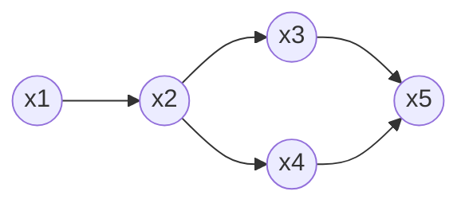
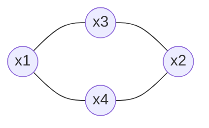
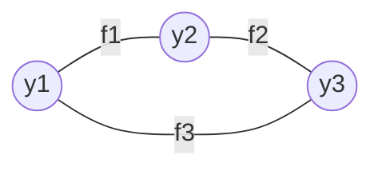
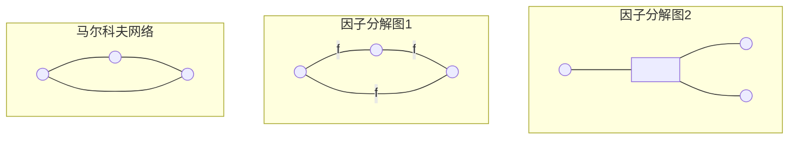

# 预备知识

在介绍HMM、MEMM、CRF之前先介绍一些前置的知识点

## Generative vs Discriminative models

生成模型 vs 判别式模型，首先需要理解这两个模型的区别，对于后续模型介绍理解会比较重要。同时，介绍这些模型的时候，也会涉及遇到一些简单的概率知识点，核心是贝叶斯公式。我们先给出文中会使用的一些符号定义。

$$
x \text{:  输入数，可以是多维数据;} \quad y \text{:  输出数据，也可以是多维数据}

$$

> ***Generative model***：核心是需要对$p(x \mid y)$ 建模，或者是对 $p(x)$建模，最终的目的是实现 $p(x,y)$的建模
> 
> ***Discriminative model***：通常是直接建模$p(y \mid x)$，不需要考虑$p(x)$

看上面的定义，有时候在实际应用中可能会存在困惑，因为二者的区别不是很明显。例如对一个生成模型$p_g(\theta)$

$$
p_g(y,x;\theta) = p_g(y;\theta) p_g(x \mid y;\theta) \\
p_g(y,x;\theta) = p_g(x;\theta) p_g(y \mid x;\theta)
$$

生成模型$p_g(y,x;\theta)$使用上面的形式的时候，看上去像生成模型，但是采用下面公式（通常是在inference的时候采用）看上去像判别式模型。其实核心还是在于我们在用判别式的时候并不考虑$p(x;\theta)$（下文中会介绍）。真正在推理的时候，我们正确使用方式是$p_g(x;\theta) = \sum_y p_g(y,x;\theta)$， $p_g(y \mid x;\theta) = {p_g(y,x;\theta) \over p_g(x;\theta)} $，也就是说虽然生成式模型可以应用于推断$p(y \mid x)$，但是底层使用的模型还是生成式模型$p_g(y,x;\theta)$

对于判别式模型，我们直接建模求解：$p(y \mid x; \hat\theta)$，而$p(x;\theta)$我们依然是未知的。

大部分情况下，我们可以断定$\theta \ne \hat\theta$。为什么很多情况下 判别式模型表现由于生成式？从上面的公式我们可以看出，生成式模型要同时满足 $p(x;\theta)$和$p(y \mid x;\theta)$的分布，而判别式模型只考虑$p(y \mid x; \theta)$，二者恰恰是真实应用场景里关注的问题所在。

> ***Generative model parameters $\theta$ are used in both the input distribution and conditional distribution, a good set of parameters must represent both well,  potentionally at the cost of tradding off accuracy on $p(y \mid x)$, the distribution we care about, for accuracy on $p(x)$, which we care less obout. On the other hand, the added degree of freedom brings about an increasing risk of overfitting the training data, and generalizing worse on unseen data.***

## Hammersley-Clifford定理证明

### 马尔可夫随机场（MRF）

> **定义一：一个无向图模型$G$称之为马尔可夫随机场（MRF），如果满足两个顶点被观测顶点分割情况下独立。也就是说对图中任意顶点$X_i$，以下条件属性成立**
> 
> $$
> \begin{equation}
P(X_i|X_{G \backslash i}) = P(X_i|X_{N_i}) 
\end{equation}
> $$
> 
> **$X_{G \backslash i}$代表除了$X_i$之外的所有顶点，$X_{N_i}$代表$i$的所有邻居顶点，即所有与$X_i$相连的顶点。**
> 
> An undirected graphical model $G$  is called a *Markov Random Field (MRF)* if two nodes are conditionally independent whenever they are separated by evidence nodes. In other words, for any node $X_i$ in the graph, the equation (1) holds, where $X_{G \backslash i}$ denotes all the nodes except $X_i$, and $X_{N_i}$ denotes the neighborhood of $X_i$ - all the nodes that are connected to $X_i$.

> 

上面两个定义直接看公式十分生涩，下面给两个例子来说明。

上面这张图是有向图，贝叶斯网络/HMM/卡尔曼滤波器都属于这类有向图网络。上面图的联合概率：

$P(x_1,\dots,x_n) = P(x_1) \cdot P(x_2 \mid x_1) \cdot P(x_3 \mid x_2) \cdot P(x_4 \mid x_2) \cdot P(x_5 \mid x_3,x_4)$

上面公式的分解很容易理解，不展开介绍。下面重点要介绍无向图概率模型（MRF）

#### 全局MRF

假设节点集合A、B是在无向图中被节点集合C分开的任意节点集合，全局马尔可夫定义 ：给定基于节点集合C的随机变量$Y_C$的条件性，$Y_A和Y_B条件独立$。

$$
P(Y_A,Y_B \mid Y_C) = P(Y_A \mid Y_C) P(Y_B \mid Y_C)
$$

从全局马尔可夫可以推导出局部马尔可夫和成对马尔可夫

#### 局部马尔可夫（Markov Banket）

又叫做马尔可夫毯，也就是前面给出的定义，一个无向图中一个节点给定它的邻居节点的情况下，独立于其它节点。下面给出一个具体例子：

设无向图中任意一节点$v$, $\mathcal{W}$是与节点$v$有边相连的所有节点，$\mathcal{O}$是$u, \mathcal{W}$之外的其它节点集合，局部马尔可夫性是指：给定$Y_{\mathcal W}$的情况下，$Y_v$与$Y_{\mathcal O}$独立。$P(Y_v,Y_{\mathcal O}) \mid Y_{\mathcal W}) = P(Y_v \mid Y_{\mathcal W}) P(Y_{\mathcal O} \mid Y_{\mathcal W})$

这个公式也可以改写为：$P(Y_v \mid Y_{\mathcal O}, Y_{\mathcal W}) = P(Y_v \mid P_{\mathcal W})$

#### 成对马尔可夫

假设无向图$G$中任意两个没有边连接的节点$u,v$，其它所有节点为$\mathcal O$，成对马尔可夫：给定$Y_{\mathcal O}$条件下，$Y_u, Y_v$条件独立。$P(Y_u, Y_v \mid Y_{\mathcal O}) = P(Y_u \mid Y_{\mathcal O}) P(Y_v \mid Y_{\mathcal O})$

上面介绍了成对、局部和全局马尔可夫性，使用大白话来说就是每一个节点的分布只和有边相连的节点有关系。**其实最大团的概念就是从成对马尔可夫衍生过来，只需要把上面的节点理解为节点集合**。

### Gibbs分布

> 定义二：在无向图模型G上的一个概率分布P(X)称之为吉布斯分布，如果它能够被因子分解为定义在**团（clique）** 上的正函数的乘积，这些团覆盖了G的所有顶点和边，即
> 
> $$
> \begin{equation}
\begin{aligned}
P(X) &= \frac{1}{Z} \prod\limits_{c \in C_G} \phi_c(X_c) \\
Z &= \sum\limits_x \prod\limits_{c \in C_G} \phi_c(X_c)
\end{aligned}
\end{equation}
> $$
> 
> C_G是G上所有（最大）团的集合，c代表一个具体的`clique`（实际上是一个小的集合），Z是归一化常量，保证满足概率定义。
> 
> A probability distribution P(X) on an undirected graphical model G is called a Gibbs distribution if it can be factorized into positive functions defined on cliques that cover all the nodes and edges of G. That is equation (2), where C_G is a set of all (maximal) cliques in G and Z = \sum_x \prod_{c \in C_G} \phi_c(X_c) is the normalization constant.
> 
> Hammersley Clifford clas 认为，MRF和Gibbs分布是一致的，也就是说：
> 
> 1. Gibbs分布一定满足由`node separation`导致的条件独立性。
> 
> 2. MRF的概率分布一定可以表示为最大团集合上的非负函数乘积形式。
> 
> We formally define the notion of whether a factor graph "describes" a given distribution or not. Let $N(a)$ be the neighbors of the factor with index $a$, i.e., a set of variable indices. Then:
> 
> $$
> \text{Definition 2.1. A distribution } p(y) 
\text{ factorizes according to 
 a factor graph } \\
 G \text{ if there exists a set of local function } \Psi_a \text{ such that } p \text{ can be written as} \\
p(y) = Z^{-1} \prod\limits_{a \in F} \Psi_a(y_{N(a)})
> $$
> 
> 下面的无向图的概率计算：$p(y_1,y_2,y_3) = \Psi_1(y_1,y_2) \Psi_2(y_2,y_3) \Psi_3(y_1,y_3)$，图中的f1/f2/f3对应$\Psi_1/\Psi_2/\Psi_3$
> 
> **最大团**：若C是无向图G的一个团（即C中任何两个节点存在G中的边相连），并且不能再加入跟着一个G的节点使其成为一个更大的团，则称此C为G的一个最大团

马尔科夫网络(markov network) vs 因子分解图(factor graph)。从无向图角度分析，下面三个图是一个图，都是三个节点之间两两连接。如果从马尔科夫网络分析，它的概率分解其实是和因子分解图2等价的，即$p(y_1,y_2,y_3) \sim f(y_1,y_2,y_3)$，但是因子分解图2 $p(y_1,y_2,y_3) \sim f(y_1,y_2) g(y_2,y_3) h(y_1,y_3)$。所以从因子分解图角度看，马尔科夫网络的概率计算是有歧义的。

Hammersley Clifford证明了上面两个定义是等价的，下面搬运证明过程

## 反向证明（吉布斯分布—> MRF）

设$D_i = N_i \cup {X_i}$是包含$X_i$邻居顶点和$X_i$本身的集合。从上面等式(1)的右边开始。另外我们引入一些符号定义：$D_i = N_i \cup \{X_i\}$是包含$X_i$和它邻居定点的集合，无向图$G$的最大团为$G_C$，并且通过判断定点$X_i$是否包含在`clique`可以将集合$G_C$分成两个集合：$C_i=c \in G_C: X_i \in c$和$R_i = c \in G_C: X_i \notin G_C$，且$C_i \cup R_i = G_C$。

$$
\begin{equation}
\begin{aligned}

P(X_i \mid X_{N_i}) &= \frac{P(X_i,X_{N_i})}{P(X_{N_i})} \\
&= \frac{\sum\limits_{G\backslash D_i} P(X_i,X_{N_i},X_{G\backslash D_i})}
   {\sum\limits_{x_i}\sum\limits_{G\backslash D_i}P(X_i,X_{N_i},X_{G\backslash D_i}) }\\
&= \frac{\sum\limits_{G\backslash D_i} \prod\limits_{c \in G_C} \phi_c(X_c)} 
    {\sum\limits_{x_i}\sum\limits_{G\backslash D_i} \prod\limits_{c \in G_C} \phi_c(X_c)} \\
&= \frac{\sum\limits_{G\backslash D_i} \prod\limits_{c \in C_i}\phi_c(X_c) \prod\limits_{c \in R_i}\phi_c(X_c)}
  {\sum\limits_{x_i}\sum\limits_{G\backslash D_i} \prod\limits_{c \in C_i}\phi_c(X_c) \prod\limits_{c \in R_i}\phi_c(X_c)} \\
&= \frac{\prod\limits_{c \in C_i}\phi_c(X_c) \left( \sum\limits_{G\backslash D_i} \prod\limits_{c \in R_i}\phi_c(X_c)  \right)}
  {\left(\sum\limits_{x_i} \prod\limits_{c \in C_i}\phi_c(X_c) \right)  \left(\sum\limits_{G\backslash D_i} \prod\limits_{c \in R_i}\phi_c(X_c) \right) }\\
&= \frac{\prod\limits_{c \in C_i}\phi_c(X_c)}{\sum\limits_{x_i} \prod\limits_{c \in C_i}\phi_c(X_c)} \times 
  \frac{\prod\limits_{c \in R_i}\phi_c(X_c)}{\prod\limits_{c \in R_i}\phi_c(X_c)} \\
&= \frac{{1 \over Z} \prod\limits_{c \in G_C} \phi_c(X_c)}
  {{1 \over Z} \sum\limits_{x_i}\prod\limits_{c \in G_C} \phi_c(X_c)} \\
&= \frac{P(X)}{P(X_{G\backslash i})} = P(X_i \mid X_{G\backslash i})
\end{aligned}
\end{equation}
$$

最终公式(3)的结论和公式(1)相同。上面的证明是严格推到，下面给出一个比较有体感的特殊例子证明。我们这次从前面的全局马尔可夫来证明下图中公式成立。

从上面的全局马尔可夫图可以得出：$P(x_A,x_B,x_c) = {1 \over Z} \phi(x_A, x_c) \phi(x_B,x_C)$，我们要证明$P(x_A,x_B \mid x_C) = P(x_A \mid x_C) P(x_B \mid x_C)$，下面给出证明：

$$
\begin{equation}
\begin{aligned}
P(x_A,x_B \mid x_C) &= \frac{P(x_A,x_B,x_C)}{P(x_C)} \\
&= \frac{P(x_A,x_B,x_C)}{\sum_{x_A}\sum_{x_B}P(x_A,x_B,x_C)} \\
&= \frac{\phi_{AC}(x_A,x_C) \phi_{BC}(x_B,x_C)}{\sum_{x_A}\sum_{x_B} \phi_{AC}(x_A,x_C) \phi_{BC}(x_B,x_C)} \\
&= \frac{\phi_{AC}(x_A,x_C)}{\sum_{x_A}\phi_{AC}(x_A,x_C)} \times
   \frac{\phi_{BC}(x_B,x_C)}{\sum_{x_B}\phi_{BC}(x_B,x_C)} \\
&= \frac{P(x_A,x_C)}{P(x_C)} \times \frac{P(x_B,x_C)}{P(x_C)} \\
&= P(x_A \mid x_C) \cdot P(x_B \mid x_C)

\end{aligned}
\end{equation}
$$

## 正向证明（MRF—>吉布斯分布）

没看明白，待续

# CRF
