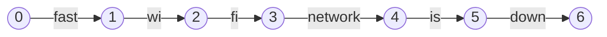
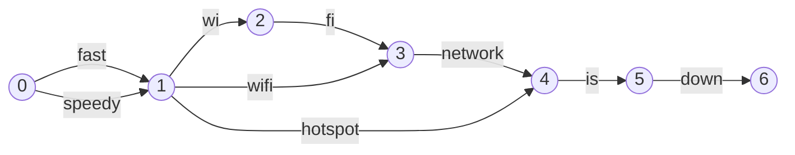
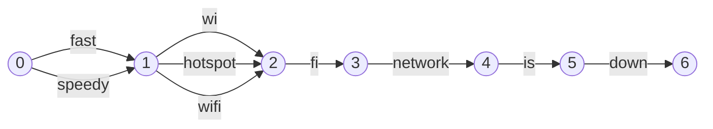
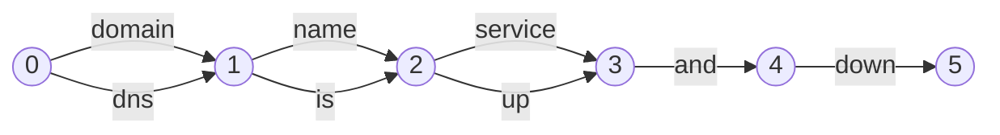
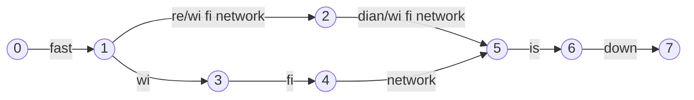

Lucene的`TokenStream`类被应用于索引建立或者是查询词分析的时候产生`Token`（更加严谨的说法应该是`Term`，因为除了关键词之外，还包括其它的额外信息，例如`Token`在原字符串中的位置，`Token`的步长以及长度等信息）。它的API是一个迭代器，每次调用`incrementToken`可以前进到一下个`Token`，然后调用相关的属性类可以获得`Token`的相关信息。例如，`CharTermAttribute`保留了`Token`的文本信息；`OffsetAttribute`保存了包括起始位置和结束位置的偏移量。

`TokenStream`实际上是一个链的结构，起始位置是一个`Tokenizer` 用于实现传统的分词操作，后面跟着若干`Filter`用于对分词结果进行更改。此外，`CharFilter`的作用是在分词前进行预处理（早于`Tokenizer`被调用），例如，可以移除HTML文档的标记，或者是对一些特定字符进行映射操作等。在Lucene中，`Analyzer`是一个工厂类负责组装上面的各个部件，包括但是不限于`Tokenizer`、`xxFilter`等。

Lucene和Solr已经预先实现了多种`Tokenizer`和`Filter`，详情参考它们各自的官方文档。

为了能够更好的理解在Lucene和Solr中如何实现分词和同义词功能，下面举一个在全文使用的例子：`fast wi fi network is down`，假设我们不考虑通用词，Lucene内部对这段文本的解析可以看做是一个图模型。`Lucene`内部实现同义词最开始是通过`SynonymFilter`，但是它的内部实现无法有效处理映射到多个单词的同义词实现，因此后来又实现了`SynonymGraphFilter`类，它可以处理多种同义词映射的情况。下面先介绍`SynonymFilter`（在Lucene中已经不建议使用，但是通过介绍对比可以更好的理解内部同义词的实现逻辑）。

如果使用一个图模型来表示上面的文本输入，那么这些`tokens`看起来如下图：

其中每一个节点表示一个位置，而一条边表示一个`token`。`TokenStream`迭代式遍历整个无环图，一次迭代访问一条边。

下一步，我们将`SynonymFilter`加入到分析链中，使用下面的同义词设置：

- fast --> speedy

- wi fi --> wifi

- wifi network --> hostspot

现在上面的图将变成类似的下图表示：

针对每一个**token(边)**，需要关注两个属性：`PositionIncrementAttribute`告诉我们这条边（token）的起始节点是前面多少个节点**开始的**，而新增加的`PosotionLengthAttribute`告诉我们这条边**覆盖**（或者说**跨越**）多少个节点（这条边的**结束节点**是后面多少个节点）

一直以来Lucene的同义词实现方式都存在难以修复的问题，也一直被广大开发者诟病。

**Problem 1**：在索引过程中Lucene完全忽视了`PositionLengthAttribute`，只关注`PositionIncrementAttribute`，这就导致所有的边只关注**起始节点**，而忽视**结束节点**（具体原因可以看上面对于这两个属性的介绍）。因此很多同义词表示的边，不仅仅有共同的起始节点，连结束节点也相同（这其实是一个错误处理方式，下面会介绍带来的问题），因此上面的图实际上变成了下面的图：

Lucene这种处理同义词的方式在遇到`phrase query`的时候会发生出乎意料的结果，一些应该匹配的短语查询实际上无法匹配到正确结果，而一些不应该匹配的短语查询却意外的匹配到了错误结果。例如对于短语查询 `hostspot is down`应该匹配确没有匹配上，而`fast hotspot fi`不应该匹配确匹配成功。当然有些短语匹配可以成功，例如`fast hotspot`。发生这种错误的根本原因是输入的图模型被错误的处理成了串行化的图模型。要修复这个问题比较有挑战性，因为需要更改索引结构，在每个位置保存一个额外的**长度**信息，并且需要同时修复**包含位置的查询处理**。

`QueryParser`也存在忽略位置长度属性的问题，但是这个问题修复相对容易，因为我们可以在查询处理的时候对查询词扩展处理来获得正确的结果，这比在索引时修复问题更加简单，因为索引修复涉及到索引重新建立，这个代价很大。

`SynonymFilter`的另一个问题是在处理同义词的时候如果替换单元包括多个单词的时候，例如当同义词存在下面的情况：

- dns --> domain name service

如果输入是`dns is up and down`对应的图模型如下图：

`(name, is)`、`(service, up)`这两对代词发生了重叠现象，同样会导致短语查询出现问题。例如：`domain name service is up`应该匹配没有匹配，`dns name up`不应该匹配却匹配了。如果要使得同义词生效，必须保证被注入的同义词单元都是单独一个单词，例如把上面的同义词替换更改成`domain name service --> dns`，上面的两个例子都可以运行正常。

从上面的几个例子可以看出，`SynonymFilter`在遇上多个单词的同义词注入的时候就会发生问题，再说一次，这个问题也是被广大开发者一直诟病的一个严重问题。

下面介绍Lucene新引入的`SynonumGraphFilter`，它被Lucene推荐替换`SynonymFilter`使用，也就是在新的代码中大家应用使用这个新的类，可以解决`SynonymFilter`中遇到的问题。

例如，输入还是上面的`fast wi fi netowrk is down`，`SynonymGraphFilter`的图模型输出如下：

可以看到，使用`SynonymGraphFilter`的分词结果是正确的。

**解决方案**

针对上述提到的同义词问题，在Lucene 6.4.0版本开始得到解决，这个版本引入了一些改进，只要我们在`search-time`引入同义词扩展而不是`index-time`引入。

**【改进一】**

第一个改进就是新引入了`SynonymGraphFilter`类，只要在代码中使用这个类替换之前的`SynonymFilter`类，就基本上能产出正确的图模型，无论被注入的同义词是单个单词还是多个单词。同时，如果一定要在索引阶段引入同义词，还可以在`SynonymGraphFilter`之后立刻加上`FlattenGraphFilter`类，可以基本将正确的信息加入到索引中，但是需要牢记，`FlattenGraphFilter`还是会在索引时丢失部分图信息（相对于完整的图模型）

**【改进二】**

> The second set of vital improvements is to the query parsers. First, the classic query parser had to [stop pre-splitting incoming query text at whitespace](https://issues.apache.org/jira/browse/LUCENE-2605), fixed (after years of controversy!) in Lucene 6.2.0. Be sure to call `setSplitOnWhitespace(false)` since the whitespace splitting is still enabled by default to preserve backwards compatibility. This change empowers the query-time analyzer to see multiple tokens as a single string instead of seeing each token separately. [These simplifications to the complex logic in `QueryBuilder`](https://issues.apache.org/jira/browse/LUCENE-6401) are also an important precursor.

**【改进三】**

> The third query parser fix is to [detect when the query-time analyzer produced a graph](https://issues.apache.org/jira/browse/LUCENE-7603), and create accurate queries as a result, also first added in Lucene 6.4.0. The query parser (specifically the [`QueryBuilder` base class](https://lucene.apache.org/core/6_4_0/core/org/apache/lucene/util/QueryBuilder.html)) now watches the `PositionLengthAttribute` and computes all paths through the graph when any token has a value greater than 1.

**【Limitatioins】**

> To make multi-token synonyms work correctly you must apply your synonyms at query time, not index-time, since a Lucene index cannot store a token graph. Search-time synonyms necessarily require more work (CPU and IO) than index-time synonyms, since more terms must be visited to answer the query, but the index will be smaller. Search-time synonyms are also more flexible, since you don't need to re-index when you change your synonyms, which is important for very large indices.
> 
> Another challenge is that `SynonymGraphFilter`, while producing correct graphs, cannot *consume* a graph, which means you cannot for example use `WordDelimiterGraphFilter` or `JapaneseTokenizer` followed by `SynonymGraphFilter` and expect synonyms to match the incoming graph fragments.
> 
> This is quite tricky to fix given the current `TokenStream` APIs, and there is a compelling experimental branch [to explore a simpler API for creating graph token streams](http://issues.apache.org/jira/browse/LUCENE-5012). While the synonym filter on that branch can already consume a graph, there is still plenty of work to be done before the change can be merged (patches welcome!).
