[设计模式介绍]([Patterns - Java Design Patterns](https://java-design-patterns.com/patterns/)

[设计模式代码](https://github.com/iluwatar/java-design-patterns.git)

[重构&设计模式(GOOD)](https://refactoring.guru/)

# 创建型设计模式

## 工厂模式

工厂模式包括**简单工厂**、**工厂方法**、**抽象工厂**这3种细分模式。其中，简单工厂和工厂方法比较常用，抽象工厂的应用场景比较特殊，所以很少用到。工厂模式用来创建不同但是相关类型的对象（继承同一父类或者接口的一组子类），由给定的参数来决定创建哪种类型的对象。实际上，如果创建对象的逻辑并不复杂，那我们直接通过new来创建对象就可以了，不需要使用工厂模式。当创建逻辑比较复杂，是一个“大工程”的时候，我们就考虑使用工厂模式，封装对象的创建过程，将对象的创建和使用相分离。

当每个对象的创建逻辑都比较简单的时候，我推荐使用简单工厂模式，将多个对象的创建逻辑放到一个工厂类中。当每个对象的创建逻辑都比较复杂的时候，为了避免设计一个过于庞大的工厂类，我们推荐使用工厂方法模式，将创建逻辑拆分得更细，每个对象的创建逻辑独立到各自的工厂类中。

详细点说，工厂模式的作用有下面4个，这也是判断要不要使用工厂模式最本质的参考标准。

- 封装变化：创建逻辑有可能变化，封装成工厂类之后，创建逻辑的变更对调用者透明。

- 代码复用：创建代码抽离到独立的工厂类之后可以复用。

- 隔离复杂性：封装复杂的创建逻辑，调用者无需了解如何创建对象。

- 控制复杂度：将创建代码抽离出来，让原本的函数或类职责更单一，代码更简洁。

除此之外，我们还讲了工厂模式一个非常经典的应用场景：依赖注入框架，比如Spring IOC、Google Guice，它用来集中创建、组装、管理对象，跟具体业务代码解耦，让程序员聚焦在业务代码的开发上。DI框架已经成为了我们平时开发的必备框架。

## Simple Factory(简单工厂模式)

也被称为静态工厂方法模式，通过提供一个静态方法来封装底层创建多种类型的对象（通常是有共同父类的子类对象，或者是实现了共同接口的对象）。在Spring框架中，创建各类Bean就是使用了简单工厂模式

提供一个接口可以在不提供具体类信息的情况下创建相互之间有关联和有继承关系的对象。

### 代码

```java
/**
 * Coin interface.
 */
public interface Coin {

  String getDescription();

}


/**
 * Enumeration for different types of coins.
 */
@RequiredArgsConstructor
@Getter
public enum CoinType {

  COPPER(CopperCoin::new),
  GOLD(GoldCoin::new);

  private final Supplier<Coin> constructor;
}


/**
 * CopperCoin implementation.
 */
public class CopperCoin implements Coin {

  static final String DESCRIPTION = "This is a copper coin.";

  @Override
  public String getDescription() {
    return DESCRIPTION;
  }
}


/**
 * GoldCoin implementation.
 */
public class GoldCoin implements Coin {

  static final String DESCRIPTION = "This is a gold coin.";

  @Override
  public String getDescription() {
    return DESCRIPTION;
  }
}


/**
 * Factory of coins.
 */
public class CoinFactory {

  /**
   * Factory method takes as a parameter the coin type and calls the appropriate class.
   */
  public static Coin getCoin(CoinType type) {
    return type.getConstructor().get();
  }
}


@Slf4j
public class App {

  /**
   * Program main entry point.
   */
  public static void main(String[] args) {
    LOGGER.info("The alchemist begins his work.");
    var coin1 = CoinFactory.getCoin(CoinType.COPPER);
    var coin2 = CoinFactory.getCoin(CoinType.GOLD);
    LOGGER.info(coin1.getDescription());
    LOGGER.info(coin2.getDescription());
  }
}
```

首先可以看到怎样创建具体的*coin*对于调用方是无感知的，它仅仅是把需要的类型参数传入，具体创建工作由底层对象自己负责。未来如果需要增加新的*coin*类型，也仅仅是增加一个*coin*定义，而客户端代码不需要任何改动。

简单工厂模式适合于直接创建简单的商品类别，而商品对象之间没有复杂的关联关系，只有简单的共同父类关系。其中父类定义公共的接口，子类实现具体接口定义。

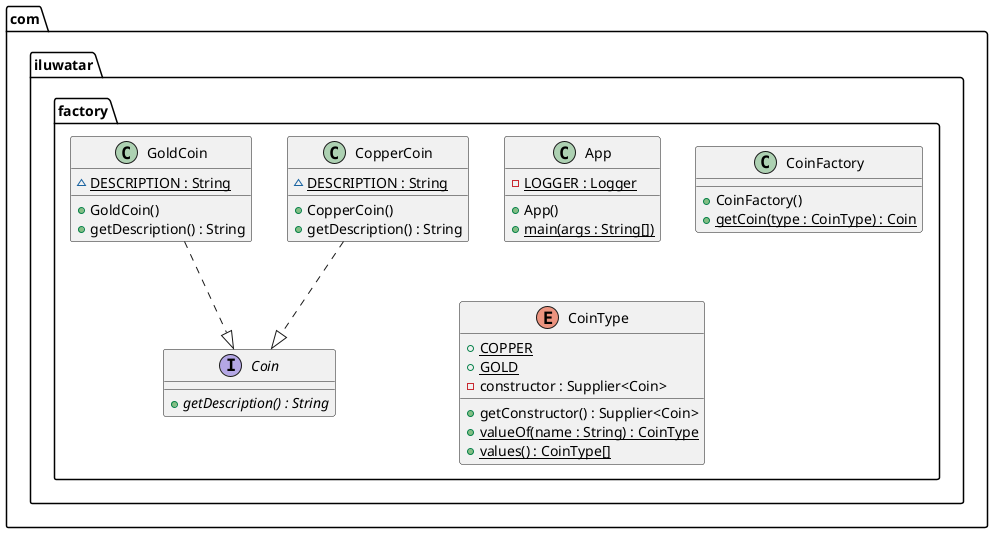

## Factory Method(工厂方法模式)

参考下面的类图：

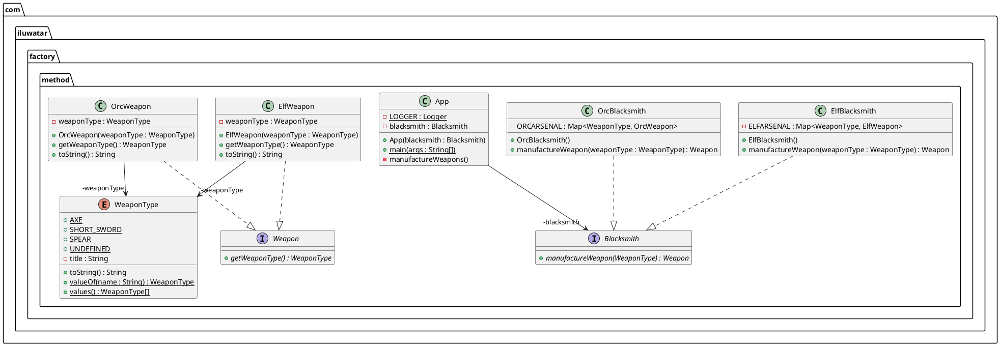

对比于**工厂模式**，最大的区别是工厂进一步抽象，并将实例化对象延迟到具体工厂对象里。例如上图中，实例化*OrcWeapon*对象是通过更加具体的工厂对象*OrcBlacksmith*实现。所以这种模式也被称为**Virtual Constructor**模式。

> **Intent**：Define an interface for creating an object, but let $subclasses^1$  decide which class to instantiate. Factory Method lets a class defer instantiation to $subclasses^2$.
> 
> Notes: 
> 
>   $sublcasses^1$ 是指具体的*product*对象，上面的UML图中是*OrcWeapon or ElfWeapon*。
> 
>   $subclasses^2$ 指具体的工厂对象，上面UML图中的*OrcBlacksmith or ElfBlacksmith*.

### 代码

```java
// 定义Product接口和对象

/**
 * Weapon interface.
 */
public interface Weapon {

  WeaponType getWeaponType();

}
/**
 * ElfWeapon.
 */
@RequiredArgsConstructor
@Getter
public class ElfWeapon implements Weapon {

  private final WeaponType weaponType;

  @Override
  public String toString() {
    return "an elven " + weaponType;
  }
}


/**
 * OrcWeapon.
 */
@RequiredArgsConstructor
@Getter
public class OrcWeapon implements Weapon {

  private final WeaponType weaponType;

  @Override
  public String toString() {
    return "an orcish " + weaponType;
  }
}


// 定义工厂接口和具体工厂实现类
/**
 * The interface containing method for producing objects.
 */
public interface Blacksmith {

  Weapon manufactureWeapon(WeaponType weaponType);

}

/**
 * Concrete subclass for creating new objects.
 */
public class ElfBlacksmith implements Blacksmith {

  private static final Map<WeaponType, ElfWeapon> ELFARSENAL;

  static {
    ELFARSENAL = new EnumMap<>(WeaponType.class);
    Arrays.stream(WeaponType.values()).forEach(type -> ELFARSENAL.put(type, new ElfWeapon(type)));
  }

  @Override
  public Weapon manufactureWeapon(WeaponType weaponType) {
    return ELFARSENAL.get(weaponType);
  }

  @Override
  public String toString() {
    return "The elf blacksmith";
  }
}


/**
 * Concrete subclass for creating new objects.
 */
public class OrcBlacksmith implements Blacksmith {

  private static final Map<WeaponType, OrcWeapon> ORCARSENAL;

  static {
    ORCARSENAL = new EnumMap<>(WeaponType.class);
    Arrays.stream(WeaponType.values()).forEach(type -> ORCARSENAL.put(type, new OrcWeapon(type)));
  }

  @Override
  public Weapon manufactureWeapon(WeaponType weaponType) {
    return ORCARSENAL.get(weaponType);
  }

  @Override
  public String toString() {
    return "The orc blacksmith";
  }
}
```

## Abstract Factory(抽象工厂模式)

类图：

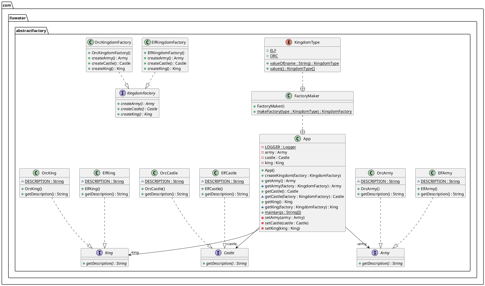

**抽象工厂模式**是**工厂方法模式**的进一步抽象。一般情况下我们建立具体的*Product*是一个具体的产品，但是如果我们需要建立的产品是一个具体的产品族，就需要进一步抽象。例如，我们要建立的对象属于*电视*这个产品，具体产品可能有*海尔电视、长虹电视、Sony电视*，可以使用简单工厂模式或者工厂方法模式，但是如果我们需要建立的不仅仅一类产品，需要建立的多个产品从另一个维度看是有一系列产品。例如要创建属于*海尔品牌*或*美的平台*的*电视、冰箱、洗衣机*，则需要我们对工厂方式进一步抽象，具体工厂有*海尔工厂*、*Sony工厂*等。

### 代码

```java
// 定义两类产品：Army、Castle
// 产品一：Army
/**
 * Army interface.
 */
public interface Army {

  String getDescription();
}
/**
 * ElfArmy.
 */
public class ElfArmy implements Army {

  static final String DESCRIPTION = "This is the elven army!";

  @Override
  public String getDescription() {
    return DESCRIPTION;
  }
}

// 产品二：Castle
/**
 * Castle interface.
 */
public interface Castle {

  String getDescription();
}
/**
 * ElfCastle.
 */
public class ElfCastle implements Castle {

  static final String DESCRIPTION = "This is the elven castle!";

  @Override
  public String getDescription() {
    return DESCRIPTION;
  }
}
/**
 * OrcCastle.
 */
public class OrcCastle implements Castle {

  static final String DESCRIPTION = "This is the orc castle!";

  @Override
  public String getDescription() {
    return DESCRIPTION;
  }
}

// 产品三：King
/**
 * King interface.
 */
public interface King {

  String getDescription();
}
/**
 * ElfKing.
 */
public class ElfKing implements King {

  static final String DESCRIPTION = "This is the elven king!";

  @Override
  public String getDescription() {
    return DESCRIPTION;
  }
}
/**
 * OrcKing.
 */
public class OrcKing implements King {

  static final String DESCRIPTION = "This is the orc king!";

  @Override
  public String getDescription() {
    return DESCRIPTION;
  }
}
////////////////////////////////////////////////////////////


// 产品族定义
/**
 * KingdomFactory factory interface.
 */
public interface KingdomFactory {

  Castle createCastle();

  King createKing();

  Army createArmy();

}
// 精灵族工厂类
/**
 * ElfKingdomFactory concrete factory.
 */
public class ElfKingdomFactory implements KingdomFactory {

  @Override
  public Castle createCastle() {
    return new ElfCastle();
  }

  @Override
  public King createKing() {
    return new ElfKing();
  }

  @Override
  public Army createArmy() {
    return new ElfArmy();
  }

}
// 兽人族工厂对象
/**
 * OrcKingdomFactory concrete factory.
 */
public class OrcKingdomFactory implements KingdomFactory {

  @Override
  public Castle createCastle() {
    return new OrcCastle();
  }

  @Override
  public King createKing() {
    return new OrcKing();
  }

  @Override
  public Army createArmy() {
    return new OrcArmy();
  }
}


///////////////////////
// 创建具体工厂对象
@Getter
@Setter
public class Kingdom {

  private King king;
  private Castle castle;
  private Army army;

  /**
   * The factory of kingdom factories.
   */
  public static class FactoryMaker {

    /**
     * Enumeration for the different types of Kingdoms.
     */
    public enum KingdomType {
      ELF, ORC
    }

    /**
     * The factory method to create KingdomFactory concrete objects.
     */
    public static KingdomFactory makeFactory(KingdomType type) {
      switch (type) {
        case ELF:
          return new ElfKingdomFactory();
        case ORC:
          return new OrcKingdomFactory();
        default:
          throw new IllegalArgumentException("KingdomType not supported.");
      }
    }
  }
}


@Slf4j
public class App implements Runnable {

  private final Kingdom kingdom = new Kingdom();

  public Kingdom getKingdom() {
    return kingdom;
  }

  /**
   * Program entry point.
   *
   * @param args command line args
   */
  public static void main(String[] args) {
    var app = new App();
    app.run();
  }

  @Override
  public void run() {
    LOGGER.info("elf kingdom");
    createKingdom(Kingdom.FactoryMaker.KingdomType.ELF);
    LOGGER.info(kingdom.getArmy().getDescription());
    LOGGER.info(kingdom.getCastle().getDescription());
    LOGGER.info(kingdom.getKing().getDescription());

    LOGGER.info("orc kingdom");
    createKingdom(Kingdom.FactoryMaker.KingdomType.ORC);
    LOGGER.info(kingdom.getArmy().getDescription());
    LOGGER.info(kingdom.getCastle().getDescription());
    LOGGER.info(kingdom.getKing().getDescription());
  }

  /**
   * Creates kingdom.
   * @param kingdomType type of Kingdom
   */
  public void createKingdom(final Kingdom.FactoryMaker.KingdomType kingdomType) {
    final KingdomFactory kingdomFactory = Kingdom.FactoryMaker.makeFactory(kingdomType);
    kingdom.setKing(kingdomFactory.createKing());
    kingdom.setCastle(kingdomFactory.createCastle());
    kingdom.setArmy(kingdomFactory.createArmy());
  }
}
```

从上面代码可以看见，产品维度有*Weapon、Castle、King*三类产品对象，产品族维度有*Elf、Orc*两个维度对象，简单工厂模式或工厂方法模式无法有效抽象这两个维度（只能从*产品类型*这个维度进行抽象）。

> Imagine that you’re creating a furniture shop simulator. Your code consists of classes that represent:
> 
> 1. A family of related products, say: `Chair` + `Sofa` + `CoffeeTable`
> 
> 2. Several variants of this family. For example, products `Chair` + `Sofa` + `CoffeeTable` are available in these variants: `Modern`, `Victorian`, `ArtDeco`.
> 
> **Solution:** 
> 
> 1. The first thing the Abstract Factory pattern suggests is to explicitly declare interfaces for each distinct product of the product family (e.g., chair, sofa or coffee table). Then you can make all variants of products follow those interfaces. For example, all chair variants can implement the `Chair` interface; all coffee table variants can implement the `CoffeeTable` interface, and so on
> 
> 2. The next move is to declare the *Abstract Factory*—an interface with a list of creation methods for all products that are part of the product family (for example, `createChair`, `createSofa` and `createCoffeeTable`). These methods must return **abstract** product types represented by the interfaces we extracted previously: `Chair`, `Sofa`, `CoffeeTable` and so on.
> 
> 3. For each variant of a product family, we create a separate factory class based on the `AbstractFactory` interface. A factory is a class that returns products of a particular kind. For example, the `ModernFurnitureFactory` can only create `ModernChair`, `ModernSofa` and `ModernCoffeeTable` objects

## Builder

类图：

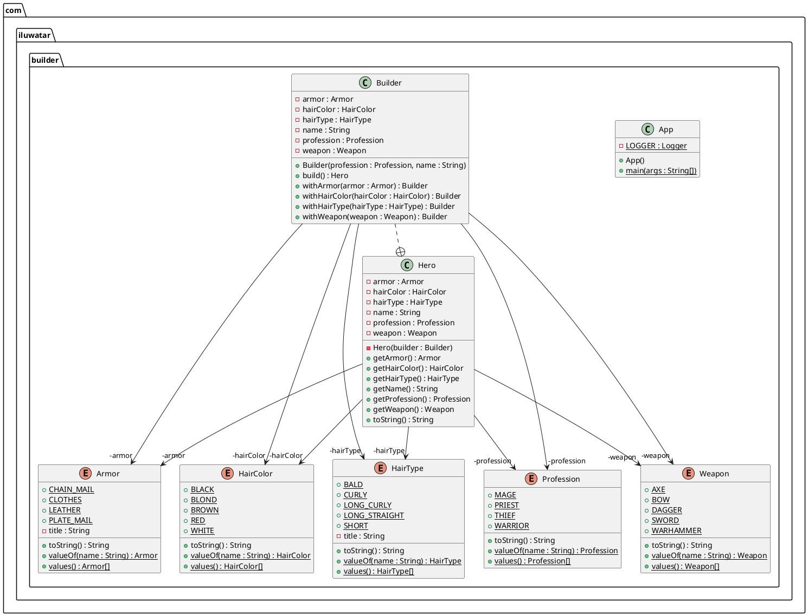

*Build*模式与其它模式的关系：

> - Many designs start by using [Factory Method](https://refactoring.guru/design-patterns/factory-method) (less complicated and more customizable via subclasses) and evolve toward [Abstract Factory](https://refactoring.guru/design-patterns/abstract-factory), [Prototype](https://refactoring.guru/design-patterns/prototype), or [Builder](https://refactoring.guru/design-patterns/builder) (more flexible, but more complicated).
> 
> - [Builder](https://refactoring.guru/design-patterns/builder) focuses on **constructing complex objects step by step**. [Abstract Factory](https://refactoring.guru/design-patterns/abstract-factory) specializes in creating **families of related objects.** *Abstract Factory* returns the product immediately, whereas *Builder* lets you run some additional construction steps before fetching the product.
> 
> - You can use [Builder](https://refactoring.guru/design-patterns/builder) when creating complex [Composite](https://refactoring.guru/design-patterns/composite) trees because you can program its construction steps to work recursively.
> 
> - You can combine [Builder](https://refactoring.guru/design-patterns/builder) with [Bridge](https://refactoring.guru/design-patterns/bridge): the *director class* plays the role of the abstraction, while different builders act as implementations.
> 
> - [Abstract Factories](https://refactoring.guru/design-patterns/abstract-factory), [Builders](https://refactoring.guru/design-patterns/builder) and [Prototypes](https://refactoring.guru/design-patterns/prototype) can all be implemented as [Singletons](https://refactoring.guru/design-patterns/singleton)


> 1. The **Builder** interface declares product construction steps that are common to all types of builders.
> 
> 2. **Concrete Builders** provide different implementations of the construction steps. Concrete builders may produce products that don’t follow the common interface.
> 
> 3. **Products** are resulting objects. Products constructed by different builders don’t have to belong to the same class hierarchy or interface.
> 
> 4. The **Director** class defines the order in which to call construction steps, so you can create and reuse specific configurations of products.
> 
> 5. The **Client** must associate one of the builder objects with the director. Usually, it’s done just once, via parameters of the director’s constructor. Then the director uses that builder object for all further construction. However, there’s an alternative approach for when the client passes the builder object to the production method of the director. In this case, you can use a different builder each time you produce something with the director.

### 模式应用场景

**Use the Builder pattern to get rid of a “telescopic constructor”.**

假设一个类的构造函数有**10**+可选参数，这时候设置这些参数会十分麻烦（现代语言例如Java和C#、C++等支持可选参数除外）

```java
class Pizza {
    Pizza(int size) { ... }
    Pizza(int size, boolean cheese) { ... }
    Pizza(int size, boolean cheese, boolean pepperoni) { ... }
    // ...
```

**Use the Builder pattern when you want your code to be able to create different representations of some product (for example, stone and wooden houses)**

如果一个类的不同对象的创建步骤基本一致，可以应用*Build*模式

**Use the Builder to construct [Composite](https://refactoring.guru/design-patterns/composite) trees or other complex objects.**

### 代码

```java
// 通用build接口
/**
 * Builder interface defines all possible ways to configure a product.
 */
public interface Builder {
    void setCarType(CarType type);
    void setSeats(int seats);
    void setEngine(Engine engine);
    void setTransmission(Transmission transmission);
    void setTripComputer(TripComputer tripComputer);
    void setGPSNavigator(GPSNavigator gpsNavigator);
}


// CarBuilder
public class CarBuilder implements Builder {
    private CarType type;
    private int seats;
    private Engine engine;
    private Transmission transmission;
    private TripComputer tripComputer;
    private GPSNavigator gpsNavigator;

    public void setCarType(CarType type) {
        this.type = type;
    }

    @Override
    public void setSeats(int seats) {
        this.seats = seats;
    }

    @Override
    public void setEngine(Engine engine) {
        this.engine = engine;
    }

    @Override
    public void setTransmission(Transmission transmission) {
        this.transmission = transmission;
    }

    @Override
    public void setTripComputer(TripComputer tripComputer) {
        this.tripComputer = tripComputer;
    }

    @Override
    public void setGPSNavigator(GPSNavigator gpsNavigator) {
        this.gpsNavigator = gpsNavigator;
    }

    public Car getResult() {
        return new Car(type, seats, engine, transmission, tripComputer, gpsNavigator);
    }
}


// 手工造车buildpublic class CarManualBuilder implements Builder{
    private CarType type;
    private int seats;
    private Engine engine;
    private Transmission transmission;
    private TripComputer tripComputer;
    private GPSNavigator gpsNavigator;

    @Override
    public void setCarType(CarType type) {
        this.type = type;
    }

    @Override
    public void setSeats(int seats) {
        this.seats = seats;
    }

    @Override
    public void setEngine(Engine engine) {
        this.engine = engine;
    }

    @Override
    public void setTransmission(Transmission transmission) {
        this.transmission = transmission;
    }

    @Override
    public void setTripComputer(TripComputer tripComputer) {
        this.tripComputer = tripComputer;
    }

    @Override
    public void setGPSNavigator(GPSNavigator gpsNavigator) {
        this.gpsNavigator = gpsNavigator;
    }

    public Manual getResult() {
        return new Manual(type, seats, engine, transmission, tripComputer, gpsNavigator);
    }
}

// Car 产品
/**
 * Car is a product class.
 */
public class Car {
    private final CarType carType;
    private final int seats;
    private final Engine engine;
    private final Transmission transmission;
    private final TripComputer tripComputer;
    private final GPSNavigator gpsNavigator;
    private double fuel = 0;

    public Car(CarType carType, int seats, Engine engine, Transmission transmission,
               TripComputer tripComputer, GPSNavigator gpsNavigator) {
        this.carType = carType;
        this.seats = seats;
        this.engine = engine;
        this.transmission = transmission;
        this.tripComputer = tripComputer;
        if (this.tripComputer != null) {
            this.tripComputer.setCar(this);
        }
        this.gpsNavigator = gpsNavigator;
    }

    public CarType getCarType() {
        return carType;
    }

    public double getFuel() {
        return fuel;
    }

    public void setFuel(double fuel) {
        this.fuel = fuel;
    }

    public int getSeats() {
        return seats;
    }

    public Engine getEngine() {
        return engine;
    }

    public Transmission getTransmission() {
        return transmission;
    }

    public TripComputer getTripComputer() {
        return tripComputer;
    }

    public GPSNavigator getGpsNavigator() {
        return gpsNavigator;
    }
}


// ManualCar产品

public class Manual {
    private final CarType carType;
    private final int seats;
    private final Engine engine;
    private final Transmission transmission;
    private final TripComputer tripComputer;
    private final GPSNavigator gpsNavigator;

    public Manual(CarType carType, int seats, Engine engine, Transmission transmission,
                  TripComputer tripComputer, GPSNavigator gpsNavigator) {
        this.carType = carType;
        this.seats = seats;
        this.engine = engine;
        this.transmission = transmission;
        this.tripComputer = tripComputer;
        this.gpsNavigator = gpsNavigator;
    }

    public String print() {
        String info = "";
        info += "Type of car: " + carType + "\n";
        info += "Count of seats: " + seats + "\n";
        info += "Engine: volume - " + engine.getVolume() + "; mileage - " + engine.getMileage() + "\n";
        info += "Transmission: " + transmission + "\n";
        if (this.tripComputer != null) {
            info += "Trip Computer: Functional" + "\n";
        } else {
            info += "Trip Computer: N/A" + "\n";
        }
        if (this.gpsNavigator != null) {
            info += "GPS Navigator: Functional" + "\n";
        } else {
            info += "GPS Navigator: N/A" + "\n";
        }
        return info;
    }
}


public enum CarType {
    CITY_CAR, SPORTS_CAR, SUV
}


// 车部件定义
public class Engine {
    private final double volume;
    private double mileage;
    private boolean started;

    public Engine(double volume, double mileage) {
        this.volume = volume;
        this.mileage = mileage;
    }

    public void on() {
        started = true;
    }

    public void off() {
        started = false;
    }

    public boolean isStarted() {
        return started;
    }

    public void go(double mileage) {
        if (started) {
            this.mileage += mileage;
        } else {
            System.err.println("Cannot go(), you must start engine first!");
        }
    }

    public double getVolume() {
        return volume;
    }

    public double getMileage() {
        return mileage;
    }
}


public class GPSNavigator {
    private String route;

    public GPSNavigator() {
        this.route = "221b, Baker Street, London  to Scotland Yard, 8-10 Broadway, London";
    }

    public GPSNavigator(String manualRoute) {
        this.route = manualRoute;
    }

    public String getRoute() {
        return route;
    }
}


public enum Transmission {
    SINGLE_SPEED, MANUAL, AUTOMATIC, SEMI_AUTOMATIC
}


public class TripComputer {

    private Car car;

    public void setCar(Car car) {
        this.car = car;
    }

    public void showFuelLevel() {
        System.out.println("Fuel level: " + car.getFuel());
    }

    public void showStatus() {
        if (this.car.getEngine().isStarted()) {
            System.out.println("Car is started");
        } else {
            System.out.println("Car isn't started");
        }
    }
}


// Director
public class Director {

    public void constructSportsCar(Builder builder) {
        builder.setCarType(CarType.SPORTS_CAR);
        builder.setSeats(2);
        builder.setEngine(new Engine(3.0, 0));
        builder.setTransmission(Transmission.SEMI_AUTOMATIC);
        builder.setTripComputer(new TripComputer());
        builder.setGPSNavigator(new GPSNavigator());
    }

    public void constructCityCar(Builder builder) {
        builder.setCarType(CarType.CITY_CAR);
        builder.setSeats(2);
        builder.setEngine(new Engine(1.2, 0));
        builder.setTransmission(Transmission.AUTOMATIC);
        builder.setTripComputer(new TripComputer());
        builder.setGPSNavigator(new GPSNavigator());
    }

    public void constructSUV(Builder builder) {
        builder.setCarType(CarType.SUV);
        builder.setSeats(4);
        builder.setEngine(new Engine(2.5, 0));
        builder.setTransmission(Transmission.MANUAL);
        builder.setGPSNavigator(new GPSNavigator());
    }
}


public class Demo {

    public static void main(String[] args) {
        Director director = new Director();

        // Director gets the concrete builder object from the client
        // (application code). That's because application knows better which
        // builder to use to get a specific product.
        CarBuilder builder = new CarBuilder();
        director.constructSportsCar(builder);

        // The final product is often retrieved from a builder object, since
        // Director is not aware and not dependent on concrete builders and
        // products.
        Car car = builder.getResult();
        System.out.println("Car built:\n" + car.getCarType());


        CarManualBuilder manualBuilder = new CarManualBuilder();

        // Director may know several building recipes.
        director.constructSportsCar(manualBuilder);
        Manual carManual = manualBuilder.getResult();
        System.out.println("\nCar manual built:\n" + carManual.print());
    }

}
```

建造者模式用来创建复杂对象，可以通过设置不同的可选参数，“定制化”地创建不同的对象。建造者模式的原理和实现比较简单，重点是掌握应用场景，避免过度使用。

如果一个类中有很多属性，为了避免构造函数的参数列表过长，影响代码的可读性和易用性，我们可以通过构造函数配合set()方法来解决。但是，如果存在下面情况中的任意一种，我们就要考虑使用建造者模式了。

- 我们把类的必填属性放到构造函数中，强制创建对象的时候就设置。如果必填的属性有很多，把这些必填属性都放到构造函数中设置，那构造函数就又会出现参数列表很长的问题。如果我们把必填属性通过set()方法设置，那校验这些必填属性是否已经填写的逻辑就无处安放了。

- 如果类的属性之间有一定的依赖关系或者约束条件，我们继续使用构造函数配合set()方法的设计思路，那这些依赖关系或约束条件的校验逻辑就无处安放了。

- 如果我们希望创建不可变对象，也就是说，对象在创建好之后，就不能再修改内部的属性值，要实现这个功能，我们就不能在类中暴露set()方法。构造函数配合set()方法来设置属性值的方式就不适用了

## Prototype(原型模式)

桥接模式的代码实现非常简单，但是理解起来稍微有点难度，并且应用场景也比较局限，所以，相对来说，桥接模式在实际的项目中并没有那么常用，你只需要简单了解，见到能认识就可以了，并不是我们学习的重点。

桥接模式有两种理解方式。第一种理解方式是“将抽象和实现解耦，让它们能独立开发”。这种理解方式比较特别，应用场景也不多。另一种理解方式更加简单，等同于“组合优于继承”设计原则，这种理解方式更加通用，应用场景比较多。不管是哪种理解方式，它们的代码结构都是相同的，都是一种类之间的组合关系。

对于第一种理解方式，弄懂定义中“抽象”和“实现”两个概念，是理解它的关键。定义中的“抽象”，指的并非“抽象类”或“接口”，而是被抽象出来的一套“类库”，它只包含骨架代码，真正的业务逻辑需要委派给定义中的“实现”来完成。而定义中的“实现”，也并非“接口的实现类”，而是的一套独立的“类库”。“抽象”和“实现”独立开发，通过对象之间的组合关系组装在一起。

**UML类图**

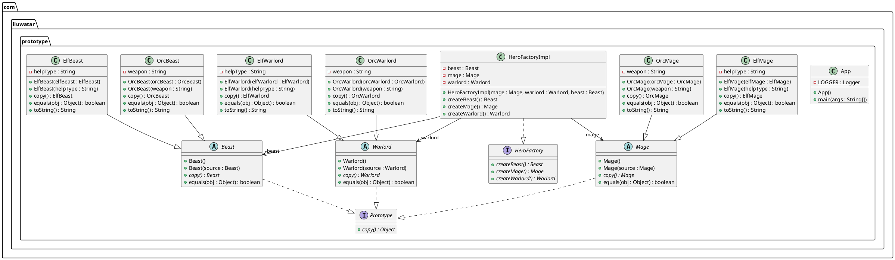

> **Prototype** is a creational design pattern that lets you copy existing objects without making your code dependent on their classes.
> 
> Specify the kinds of objects to create using a prototypical instance, and create new objects by copying this prototype.
> 
> First, it should be noted that the Prototype pattern is not used to gain performance benefits. It's only used for creating new objects from prototype instances. 
> 
> In short, it allows you to create a copy of an existing object and modify it to your needs, instead of going through the trouble of creating an object from scratch and setting it up.

原型模式是指复制对象，然后做微小的修改（CURD），然后使用这个对象。这样做可以避免程序依赖于其它对象，实现代码解耦。

通常实现了**clone**接口的对象都是原型对象（例如Java里实现了*Clone*接口）

实现方案：

> 1. Create the prototype interface and declare the `clone` method in it. Or just add the method to all classes of an existing class hierarchy, if you have one
> 
> 2. A prototype class must define the alternative constructor that accepts an object of that class as an argument. The constructor must copy the values of all fields defined in the class from the passed object into the newly created instance. If you’re changing a subclass, you must call the parent constructor to let the superclass handle the cloning of its private fields.
> 
> 3. The cloning method usually consists of just one line: running a `new` operator with the prototypical version of the constructor. Note, that every class must explicitly override the cloning method and use its own class name along with the `new` operator. Otherwise, the cloning method may produce an object of a parent class.
> 
> 4. Optionally, create a centralized prototype registry to store a catalog of frequently used prototypes.

与其它模式之间的关系：

> - Many designs start by using [Factory Method](https://refactoring.guru/design-patterns/factory-method) (less complicated and more customizable via subclasses) and evolve toward [Abstract Factory](https://refactoring.guru/design-patterns/abstract-factory), [Prototype](https://refactoring.guru/design-patterns/prototype), or [Builder](https://refactoring.guru/design-patterns/builder) (more flexible, but more complicated).
> - [Abstract Factory](https://refactoring.guru/design-patterns/abstract-factory) classes are often based on a set of [Factory Methods](https://refactoring.guru/design-patterns/factory-method), but you can also use [Prototype](https://refactoring.guru/design-patterns/prototype) to compose the methods on these classes
> - [Prototype](https://refactoring.guru/design-patterns/prototype) can help when you need to save copies of [Commands](https://refactoring.guru/design-patterns/command) into history
> - Designs that make heavy use of [Composite](https://refactoring.guru/design-patterns/composite) and [Decorator](https://refactoring.guru/design-patterns/decorator) can often benefit from using [Prototype](https://refactoring.guru/design-patterns/prototype). Applying the pattern lets you clone complex structures instead of re-constructing them from scratch
> - [Prototype](https://refactoring.guru/design-patterns/prototype) isn’t based on inheritance, so it doesn’t have its drawbacks. On the other hand, *Prototype* requires a complicated initialization of the cloned object. [Factory Method](https://refactoring.guru/design-patterns/factory-method) is based on inheritance but doesn’t require an initialization step.
> - Sometimes [Prototype](https://refactoring.guru/design-patterns/prototype) can be a simpler alternative to [Memento](https://refactoring.guru/design-patterns/memento). This works if the object, the state of which you want to store in the history, is fairly straightforward and doesn’t have links to external resources, or the links are easy to re-establish
> - [Abstract Factories](https://refactoring.guru/design-patterns/abstract-factory), [Builders](https://refactoring.guru/design-patterns/builder) and [Prototypes](https://refactoring.guru/design-patterns/prototype) can all be implemented as [Singletons](https://refactoring.guru/design-patterns/singleton).

### 代码

```java
// 原型模式接口定义
/**
 * Prototype.
 */
public interface Prototype {

  Object copy();

}


// 原型对象类定义
/**
 * Beast.
 */
@EqualsAndHashCode
@NoArgsConstructor
public abstract class Beast implements Prototype {

  public Beast(Beast source) {
  }

  @Override
  public abstract Beast copy();

}

@EqualsAndHashCode(callSuper = true)
@RequiredArgsConstructor
public class ElfBeast extends Beast {

  private final String helpType;

  public ElfBeast(ElfBeast elfBeast) {
    super(elfBeast);
    this.helpType = elfBeast.helpType;
  }

  @Override
  public ElfBeast copy() {
    return new ElfBeast(this);
  }

  @Override
  public String toString() {
    return "Elven eagle helps in " + helpType;
  }

}


@EqualsAndHashCode(callSuper = false)
@RequiredArgsConstructor
public class OrcBeast extends Beast {

  private final String weapon;

  public OrcBeast(OrcBeast orcBeast) {
    super(orcBeast);
    this.weapon = orcBeast.weapon;
  }

  @Override
  public OrcBeast copy() {
    return new OrcBeast(this);
  }

  @Override
  public String toString() {
    return "Orcish wolf attacks with " + weapon;
  }

}


@EqualsAndHashCode
@NoArgsConstructor
public abstract class Mage implements Prototype {

  public Mage(Mage source) {
  }

  @Override
  public abstract Mage copy();

}


@EqualsAndHashCode(callSuper = true)
@RequiredArgsConstructor
public class ElfMage extends Mage {

  private final String helpType;

  public ElfMage(ElfMage elfMage) {
    super(elfMage);
    this.helpType = elfMage.helpType;
  }

  @Override
  public ElfMage copy() {
    return new ElfMage(this);
  }

  @Override
  public String toString() {
    return "Elven mage helps in " + helpType;
  }

}


@EqualsAndHashCode(callSuper = true)
@RequiredArgsConstructor
public class OrcMage extends Mage {

  private final String weapon;

  public OrcMage(OrcMage orcMage) {
    super(orcMage);
    this.weapon = orcMage.weapon;
  }

  @Override
  public OrcMage copy() {
    return new OrcMage(this);
  }

  @Override
  public String toString() {
    return "Orcish mage attacks with " + weapon;
  }

}


@EqualsAndHashCode
@NoArgsConstructor
public abstract class Warlord implements Prototype {

  public Warlord(Warlord source) {
  }

  @Override
  public abstract Warlord copy();

}


@EqualsAndHashCode
public class ElfWarlord extends Warlord {

  private final String helpType;

  public ElfWarlord(String helpType) {
    this.helpType = helpType;
  }

  public ElfWarlord(ElfWarlord elfWarlord) {
    super(elfWarlord);
    this.helpType = elfWarlord.helpType;
  }

  @Override
  public ElfWarlord copy() {
    return new ElfWarlord(this);
  }

  @Override
  public String toString() {
    return "Elven warlord helps in " + helpType;
  }
}


@EqualsAndHashCode(callSuper = true)
@RequiredArgsConstructor
public class OrcWarlord extends Warlord {

  private final String weapon;

  public OrcWarlord(OrcWarlord orcWarlord) {
    super(orcWarlord);
    this.weapon = orcWarlord.weapon;
  }

  @Override
  public OrcWarlord copy() {
    return new OrcWarlord(this);
  }

  @Override
  public String toString() {
    return "Orcish warlord attacks with " + weapon;
  }

}


///////////////////////////////////

public interface HeroFactory {

  Mage createMage();

  Warlord createWarlord();

  Beast createBeast();

}


  /**
   * Create warlord.
   */
  public Warlord createWarlord() {
    return warlord.copy();
  }

  /**
   * Create beast.
   */
  public Beast createBeast() {
    return beast.copy();
  }

}


/////////////
@Slf4j
public class App {

  /**
   * Program entry point.
   *
   * @param args command line args
   */
  public static void main(String[] args) {
    var factory = new HeroFactoryImpl(
        new ElfMage("cooking"),
        new ElfWarlord("cleaning"),
        new ElfBeast("protecting")
    );
    var mage = factory.createMage();
    var warlord = factory.createWarlord();
    var beast = factory.createBeast();
    LOGGER.info(mage.toString());
    LOGGER.info(warlord.toString());
    LOGGER.info(beast.toString());

    factory = new HeroFactoryImpl(
        new OrcMage("axe"),
        new OrcWarlord("sword"),
        new OrcBeast("laser")
    );
    mage = factory.createMage();
    warlord = factory.createWarlord();
    beast = factory.createBeast();
    LOGGER.info(mage.toString());
    LOGGER.info(warlord.toString());
    LOGGER.info(beast.toString());
  }
}
```

## Singleton(单例模式)

UML类图：

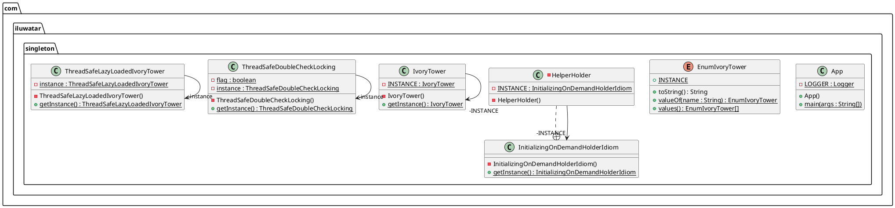

目的是确保系统中某个特定的(单例)类只有一个实例对象。

> Solution:
> 
> - Make the default constructor private, to prevent other objects from using the `new` operator with the Singleton class
> 
> - Create a static creation method that acts as a constructor. Under the hood, this method calls the private constructor to create an object and saves it in a static field. All following calls to this method return the cached object

### 通过Enum类实现单例

```java
/**
 * <p>Enum based singleton implementation. Effective Java 2nd Edition (Joshua Bloch) p. 18</p>
 *
 * <p>This implementation is thread safe, however adding any other method and its thread safety
 * is developers responsibility.</p>
 */
public enum EnumIvoryTower {

  INSTANCE;

  @Override
  public String toString() {
    return getDeclaringClass().getCanonicalName() + "@" + hashCode();
  }
}
```

### 按需分配的单例模式(线程安全方案，推荐)

```java
/**
 * <p>The Initialize-on-demand-holder idiom is a secure way of creating a lazy initialized singleton
 * object in Java.</p>
 *
 * <p>The technique is as lazy as possible and works in all known versions of Java. It takes
 * advantage of language guarantees about class initialization, and will therefore work correctly
 * in all Java-compliant compilers and virtual machines.</p>
 *
 * <p>The inner class is referenced no earlier (and therefore loaded no earlier by the class loader)
 * than the moment that getInstance() is called. Thus, this solution is thread-safe without
 * requiring special language constructs (i.e. volatile or synchronized).</p>
 *
 */
public final class InitializingOnDemandHolderIdiom {

  /**
   * Private constructor.
   */
  private InitializingOnDemandHolderIdiom() {
  }

  /**
   * Singleton instance.
   *
   * @return Singleton instance
   */
  public static InitializingOnDemandHolderIdiom getInstance() {
    return HelperHolder.INSTANCE;
  }

  /**
   * Provides the lazy-loaded Singleton instance.
   */
  private static class HelperHolder {
    private static final InitializingOnDemandHolderIdiom INSTANCE =
        new InitializingOnDemandHolderIdiom();
  }
}
```

### 预先分配的单例模式(线程安全)

```java
/**
 * Singleton class. Eagerly initialized static instance guarantees thread safety.
 */
public final class IvoryTower {

  /**
   * Private constructor so nobody can instantiate the class.
   */
  private IvoryTower() {
  }

  /**
   * Static to class instance of the class.
   */
  private static final IvoryTower INSTANCE = new IvoryTower();

  /**
   * To be called by user to obtain instance of the class.
   *
   * @return instance of the singleton.
   */
  public static IvoryTower getInstance() {
    return INSTANCE;
  }
}
```

### DoubleCehck的加锁方案

```java
/**
 * <p>Double check locking.</p>
 *
 * <p>http://www.cs.umd.edu/~pugh/java/memoryModel/DoubleCheckedLocking.html</p>
 *
 * <p>Broken under Java 1.4.</p>
 *
 * @author mortezaadi@gmail.com
 */
public final class ThreadSafeDoubleCheckLocking {

  private static volatile ThreadSafeDoubleCheckLocking instance;

  /**
   * private constructor to prevent client from instantiating.
   */
  private ThreadSafeDoubleCheckLocking() {
    // to prevent instantiating by Reflection call
    if (instance != null) {
      throw new IllegalStateException("Already initialized.");
    }
  }

  /**
   * Public accessor.
   *
   * @return an instance of the class.
   */
  public static ThreadSafeDoubleCheckLocking getInstance() {
    // local variable increases performance by 25 percent
    // Joshua Bloch "Effective Java, Second Edition", p. 283-284

    var result = instance;
    // Check if singleton instance is initialized.
    // If it is initialized then we can return the instance.
    if (result == null) {
      // It is not initialized but we cannot be sure because some other thread might have
      // initialized it in the meanwhile.
      // So to make sure we need to lock on an object to get mutual exclusion.
      synchronized (ThreadSafeDoubleCheckLocking.class) {
        // Again assign the instance to local variable to check if it was initialized by some
        // other thread while current thread was blocked to enter the locked zone.
        // If it was initialized then we can return the previously created instance
        // just like the previous null check.
        result = instance;
        if (result == null) {
          // The instance is still not initialized so we can safely
          // (no other thread can enter this zone)
          // create an instance and make it our singleton instance.
          instance = result = new ThreadSafeDoubleCheckLocking();
        }
      }
    }
    return result;
  }
}
```

### 加锁方案(效率最低)

```java
/**
 * <p>Thread-safe Singleton class. The instance is lazily initialized and thus needs synchronization
 * mechanism.</p>
 *
 */
public final class ThreadSafeLazyLoadedIvoryTower {

  private static volatile ThreadSafeLazyLoadedIvoryTower instance;

  private ThreadSafeLazyLoadedIvoryTower() {
    // Protect against instantiation via reflection
    if (instance != null) {
      throw new IllegalStateException("Already initialized.");
    }
  }

  /**
   * The instance doesn't get created until the method is called for the first time.
   */
  public static synchronized ThreadSafeLazyLoadedIvoryTower getInstance() {
    if (instance == null) {
      synchronized (ThreadSafeLazyLoadedIvoryTower.class) {
        if (instance == null) {
          instance = new ThreadSafeLazyLoadedIvoryTower();
        }
      }
    }
    return instance;
  }
}
```

# 结构型设计模式

## Bridge(桥接模式)

桥接模式的背景介绍

> **Bridge** is a structural design pattern that lets you split a large class or a set of closely related classes into two separate hierarchies—abstraction and implementation—which can be developed independently of each other.

上面的介绍有些抽象，下面举一个具体的例子，参考下图：


现在有一个类定义`Shape`表示形状，假如向增加另一个维度的描述`Color`，如果使用类继承关系，2种形状+2种颜色，使用类继承体系来描述，类目数量或扩展到4 。如果再增加一个颜色，类数量会扩充到6. 所以增加形状数量和颜色数量，会导致整体类目数量指数级增长。

为了解决上述问题，我们可以使用`Bridge Pattern`，参考下图：


`Bridge Pattern`使用了`组合`的概念来替换`继承`来解决这个问题

> The Bridge pattern attempts to solve this problem by switching from inheritance to the object composition. What this means is that you extract one of the dimensions into a separate class hierarchy, so that the original classes will reference an object of the new hierarchy, instead of having all of its state and behaviors within one class

实现方式：

1. Identify the orthogonal dimensions in your classes. These independent concepts could be: abstraction/platform, domain/infrastructure, front-end/back-end, or interface/implementation

2. See what operations the client needs and define them in the base abstraction class

3. Determine the operations available on all platforms. Declare the ones that the abstraction needs in the general implementation interface

4. For all platforms in your domain create concrete implementation classes, but make sure they all follow the implementation interface

5. Inside the abstraction class, add a reference field for the implementation type. The abstraction delegates most of the work to the implementation object that’s referenced in that field

6. If you have several variants of high-level logic, create refined abstractions for each variant by extending the base abstraction class

7. The client code should pass an implementation object to the abstraction’s constructor to associate one with the other. After that, the client can forget about the implementation and work only with the abstraction object

### 代码

UML类图：

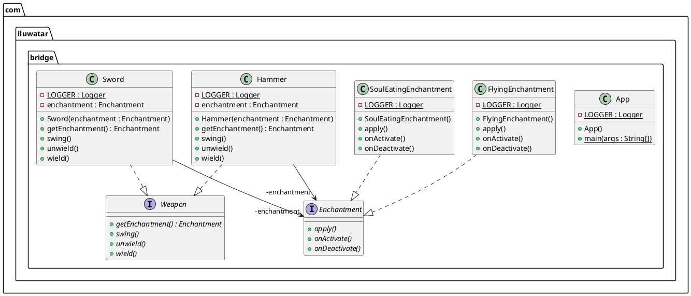

**任务介绍**：我们需要设计一些武器，每种武器都有不同的魔法效应。我们应该怎么设计这些武器？假设武器类型有*M*类，魔法效应有*N*类，一种方案是为每种武器搭配每种魔法效应来设计，那么最终武器的数量是 $M \times N$，这是一种设计方案；另一种设计方案是分别设计两种`Class`，一种是武器类型，一种是魔法类型。`Bridge Pattern` 采用后一种方案。正如上面描述，桥接模式通过`组合`来替代`继承`，将抽象放在`组合`类中，具体实现放在`被组合`类

```java
// Step 1 ~ Step 4，将魔法效应做为被抽象的维度
public interface Enchantment {

  void onActivate();

  void apply();

  void onDeactivate();
}


// 具体实现 1，“飞行”魔法效果
@Slf4j
public class FlyingEnchantment implements Enchantment {

  @Override
  public void onActivate() {
    LOGGER.info("The item begins to glow faintly.");
  }

  @Override
  public void apply() {
    LOGGER.info("The item flies and strikes the enemies finally returning to owner's hand.");
  }

  @Override
  public void onDeactivate() {
    LOGGER.info("The item's glow fades.");
  }
}


// 具体实现 2，“噬魂”魔法效果
@Slf4j
public class SoulEatingEnchantment implements Enchantment {

  @Override
  public void onActivate() {
    LOGGER.info("The item spreads bloodlust.");
  }

  @Override
  public void apply() {
    LOGGER.info("The item eats the soul of enemies.");
  }

  @Override
  public void onDeactivate() {
    LOGGER.info("Bloodlust slowly disappears.");
  }
}


// Step 5，定义了获得 “魔法”维度抽象的获取接口
public interface Weapon {

  void wield();

  void swing();

  void unwield();

  Enchantment getEnchantment();  // 获得“魔法效应”维度的抽象
}


@Slf4j
@AllArgsConstructor
public class Sword implements Weapon {

  private final Enchantment enchantment;

  @Override
  public void wield() {
    LOGGER.info("The sword is wielded.");
    enchantment.onActivate();
  }

  @Override
  public void swing() {
    LOGGER.info("The sword is swung.");
    enchantment.apply();
  }

  @Override
  public void unwield() {
    LOGGER.info("The sword is unwielded.");
    enchantment.onDeactivate();
  }

  @Override
  public Enchantment getEnchantment() {
    return enchantment;
  }
}


@Slf4j
@AllArgsConstructor
public class Hammer implements Weapon {

  private final Enchantment enchantment; // Step 5，抽象应用具体实现类

  @Override
  public void wield() {
    LOGGER.info("The hammer is wielded.");
    enchantment.onActivate();
  }

  @Override
  public void swing() {
    LOGGER.info("The hammer is swung.");
    enchantment.apply();
  }

  @Override
  public void unwield() {
    LOGGER.info("The hammer is unwielded.");
    enchantment.onDeactivate();
  }

  @Override
  public Enchantment getEnchantment() {
    return enchantment;
  }
}


// Step 7，客户端需要传入"魔法效应"具体实现类实例给`Weapon`的构造函数
@Slf4j
public class App {

  /**
   * Program entry point.
   *
   * @param args command line args
   */
  public static void main(String[] args) {
    LOGGER.info("The knight receives an enchanted sword.");
    var enchantedSword = new Sword(new SoulEatingEnchantment());
    enchantedSword.wield();
    enchantedSword.swing();
    enchantedSword.unwield();

    LOGGER.info("The valkyrie receives an enchanted hammer.");
    var hammer = new Hammer(new FlyingEnchantment());
    hammer.wield();
    hammer.swing();
    hammer.unwield();
  }
}
```

## Adapter(适配器模式)

主要的功能是将一个接口转换成另外一个接口，使得原本不兼容的接口设计能够适配。

UML类图：

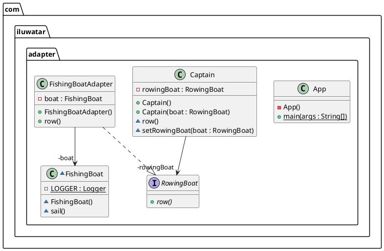

### 代码

```java
// 下面将FishingBoad的接口是·sail·
final class FishingBoat {
  void sail() {
    LOGGER.info("The fishing boat is sailing");
  }

}


// 使用装饰器将`sail`接口转换成`row`接口

  private final FishingBoat boat = new FishingBoat();

  public final void row() {
    boat.sail();
  }
}
```

## Decorator(装饰器模式)

当一个类的功能不满足需求时，一种直接的方案是通过继承在子类中增加新功能。继承方案尽量少用，这是可以考虑使用装饰器模式。简而言之，`装饰器模式`提供了一种给现有类动态增加新功能的能力。

装饰器模式主要解决继承关系过于复杂的问题，通过组合来替代继承，给原始类添加增强功能。这也是判断是否该用装饰器模式的一个重要的依据。除此之外，装饰器模式还有一个特点，那就是可以对原始类嵌套使用多个装饰器。为了满足这样的需求，在设计的时候，装饰器类需要跟原始类继承相同的抽象类或者接口。

> Decorator pattern lets you dynamically change the behavior of an object at run time by wrapping them in an object of a decorator class.
> 
> Inheritance vs. Decorator
> 
> - Inheritance is static. You can’t alter the behavior of an existing object at runtime. You can only replace the whole object with another one that’s created from a different subclass
> 
> - Subclasses can have just one parent class. In most languages, inheritance doesn’t let a class inherit behaviors of multiple classes at the same time.


`Wrapper`通常是装饰器模式实现的时候采用的别名，通常是在一个已有的类定义上进行扩充（通过组合方式），并且很关键的一点是它的接口和被装饰的类保持一致。

### 实现步骤

> 1. Make sure your business domain can be represented as a primary component with multiple optional layers over it.
> 
> 2. Figure out what methods are common to both the primary component and the optional layers. Create a component interface and declare those methods there
> 
> 3. Create a concrete component class and define the base behavior in it
> 
> 4. Create a base decorator class. It should have a field for storing a reference to a wrapped object. The field should be declared with the component interface type to allow linking to concrete components as well as decorators. The base decorator must delegate all work to the wrapped object
> 
> 5. Make sure all classes implement the component interface
> 
> 6. Create concrete decorators by extending them from the base decorator. A concrete decorator must execute its behavior before or after the call to the parent method (which always delegates to the wrapped object)
> 
> 7. The client code must be responsible for creating decorators and composing them in the way the client needs

### 代码

UML类图：

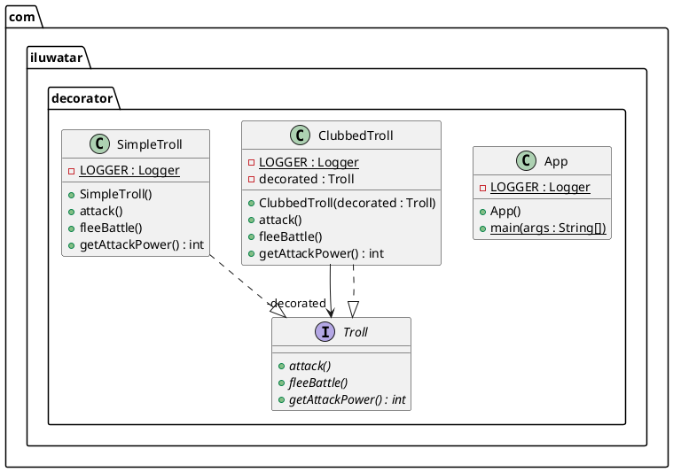

```java
// 抽象提取出接口 Step 1~2
public interface Troll {

  void attack();

  int getAttackPower();

  void fleeBattle();

}


// Step 3
@Slf4j
public class SimpleTroll implements Troll {

  @Override
  public void attack() {
    LOGGER.info("The troll tries to grab you!");
  }

  @Override
  public int getAttackPower() {
    return 10;
  }

  @Override
  public void fleeBattle() {
    LOGGER.info("The troll shrieks in horror and runs away!");
  }
}


// Step 4~6
// 注意，这里的Step 4已经简化了，没有创建一个Base Decorator
@Slf4j
@RequiredArgsConstructor
public class ClubbedTroll implements Troll {

  private final Troll decorated;

  @Override
  public void attack() {
    decorated.attack();
    LOGGER.info("The troll swings at you with a club!");
  }

  @Override
  public int getAttackPower() {
    return decorated.getAttackPower() + 10;
  }

  @Override
  public void fleeBattle() {
    decorated.fleeBattle();
  }
}
```

### Decorator Pattern与其它Pattern之间的关系

> - [Adapter](https://refactoring.guru/design-patterns/adapter) changes the interface of an existing object, while [Decorator](https://refactoring.guru/design-patterns/decorator) enhances an object without changing its interface. In addition, *Decorator* supports recursive composition, which isn’t possible when you use *Adapter*.`适配器`是改变了一个对象的接口，使得它能够适配另外一个接口。`装饰器`是针对已存在的接口功能进行增强操作，本质上和原始接口的内容一致。例如，假设有一个接口功能是把输入文本的HTML4.0标签移除，而装饰器能够在原始接口能力上额外再移除HTML5的标签
> 
> - [Chain of Responsibility](https://refactoring.guru/design-patterns/chain-of-responsibility) and [Decorator](https://refactoring.guru/design-patterns/decorator) have very similar class structures. Both patterns rely on recursive composition to pass the execution through a series of objects. However, there are several crucial differences.
>   
>   The *CoR* handlers can execute arbitrary operations independently of each other. They can also stop passing the request further at any point. On the other hand, various *Decorators* can extend the object’s behavior while keeping it consistent with the base interface. In addition, decorators aren’t allowed to break the flow of the request.
>   
>   `CoR` 最显著的区别是它可以中断处理流的链路，而适配器不允许重点任务流。另外，`CoR`的任务流之间可以是完全独立的处理操作，而适配器一般是同一种类型的操作，它的主要功能是在之前适配器处理基础上，增强其处理能力
> 
> - [Composite](https://refactoring.guru/design-patterns/composite) and [Decorator](https://refactoring.guru/design-patterns/decorator) have similar structure diagrams since both rely on recursive composition to organize an open-ended number of objects.
>   
>   A *Decorator* is like a *Composite* but only has one child component. There’s another significant difference: *Decorator* adds additional responsibilities to the wrapped object, while *Composite* just “sums up” its children’s results.
>   
>   However, the patterns can also cooperate: you can use *Decorator* to extend the behavior of a specific object in the *Composite* tree.
>   
>   `适配器`模式其实使用的就是`Composite`技术来实现，但是前者主要是对某一个接口功能进行增强粗粒，而后者主要强调集成各个子对象的能力。子对象之间可以没有任何关联，例如一个子对象可以实现跑步功能，另一个子对象可以实现对话功能，最终通过集成赋予机器人行走和对话功能
> 
> - Designs that make heavy use of [Composite](https://refactoring.guru/design-patterns/composite) and [Decorator](https://refactoring.guru/design-patterns/decorator) can often benefit from using [Prototype](https://refactoring.guru/design-patterns/prototype). Applying the pattern lets you clone complex structures instead of re-constructing them from scratch
> 
> - [Decorator](https://refactoring.guru/design-patterns/decorator) lets you change the skin of an object, while [Strategy](https://refactoring.guru/design-patterns/strategy) lets you change the guts
> 
> - [Decorator](https://refactoring.guru/design-patterns/decorator) and [Proxy](https://refactoring.guru/design-patterns/proxy) have similar structures, but very different intents. Both patterns are built on the composition principle, where one object is supposed to delegate some of the work to another. The difference is that a *Proxy* usually manages the life cycle of its service object on its own, whereas the composition of *Decorators* is always controlled by the client
>   
>   **重点关注**：`适配器模式`和`代理模式`十分类似，经常会给大家困惑，而且这两个模式的实现技术也十分类似，如何对这两种模式进行有效区分？`代理`通常负责被代理对象的整个生命周期（负责创建和销毁）；Java自带的动态代理是一个典型代表，用户并不需要负责管理被代理对象。而`装饰器`相反，被装饰的对象通常是由客户端代码负责创建，然后传递给装饰器对象。另外一个区别有些隐晦，代理器通常是在被代理对象接口能力上增加其它功能。举一个例子，通常打日志是通过代理模式实现，假设我们要给之前举例的文本标签移除接口增加打印日志功能，大家可能会毫不犹豫选择代理模式。事实上在很多框架中都是通过代理方式实现增加打印日志功能。想象一下，如果使用装饰器模式来实现在原有能力上增加打印日志功能，虽然也可以实现，但是如果另外一个计算多边形面积的接口也需要增加打印日志功能，则需要新创建一个装饰器对象。这样显然不如代理方案更加简洁。

## Proxy(代理模式)

> **Proxy** is a structural design pattern that lets you provide a substitute or placeholder for another object. A proxy controls access to the original object, allowing you to perform something either before or after the request gets through to the original object.

`代理`是在框架中一个被频繁使用的设计模式，代理类实际上已经完全替换了被代理类，但是对于用户来说是完全透明的，客户正常使用被代理对象的接口，就好像面对的就是被代理对象。

代理模式常用在业务系统中开发一些非功能性需求，比如：监控、统计、鉴权、限流、事务、幂等、日志。我们将这些附加功能与业务功能解耦，放到代理类统一处理，让程序员只需要关注业务方面的开发。除此之外，代理模式还可以用在RPC、缓存等应用场景中。

### 实现步骤

> 1. If there’s no pre-existing service interface, create one to make proxy and service objects interchangeable. Extracting the interface from the service class isn’t always possible, because you’d need to change all of the service’s clients to use that interface. Plan B is to make the proxy a subclass of the service class, and this way it’ll inherit the interface of the service.
> 
> 2. Create the proxy class. It should have a field for storing a reference to the service. Usually, proxies create and manage the whole life cycle of their services. On rare occasions, a service is passed to the proxy via a constructor by the client
> 
> 3. Implement the proxy methods according to their purposes. In most cases, after doing some work, the proxy should delegate the work to the service object
> 
> 4. Consider introducing a creation method that decides whether the client gets a proxy or a real service. This can be a simple static method in the proxy class or a full-blown factory method
> 
> 5. Consider implementing lazy initialization for the service object

### 代码

**【UML类图】**

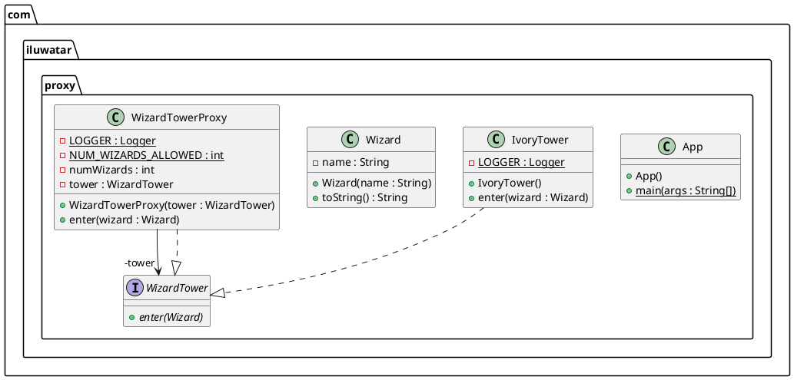

> 网上有很多关于代理模式的介绍，这里不再展开描述。代理最重要的是JDK自带的`动态代理`方案，或者是`cglib`方式

## Facade(门面模式)

`Facade`模式提供了一个简化的接口来封装底层一个复杂的子系统或者是框架。为什么？这是因为在实际业务场景，我们可能向利用已有的一个底层系统的一小部分能力，但是大部分能力我们暂时不需要，所以可以通过这个模式来封装底层子系统使用的复杂性。例如加入我们需要对一个视频做一个特定的格式转换，现在有一个底层库，能够提供各种格式的视频编码、解码、转码能力，以及音频的编解码和转码，同时还存在各种分割、合成等其它能力。这时候我们可以通过`Facade`模式封装底层，只提供特定格式的视频转码能力，而屏蔽底层子系统的复杂性。

### 实现步骤

> 1. Check whether it’s possible to provide a simpler interface than what an existing subsystem already provides. You’re on the right track if this interface makes the client code independent from many of the subsystem’s classes.
> 
> 2. Declare and implement this interface in a new facade class. The facade should redirect the calls from the client code to appropriate objects of the subsystem. The facade should be responsible for initializing the subsystem and managing its further life cycle unless the client code already does this.
> 
> 3. To get the full benefit from the pattern, make all the client code communicate with the subsystem only via the facade. Now the client code is protected from any changes in the subsystem code. For example, when a subsystem gets upgraded to a new version, you will only need to modify the code in the facade.
> 
> 4. If the facade becomes [too big](https://refactoring.guru/smells/large-class), consider extracting part of its behavior to a new, refined facade class.

### 代码

```java
// These are some of the classes of a complex 3rd-party video
// conversion framework. We don't control that code, therefore
// can't simplify it.

class VideoFile
// ...

class OggCompressionCodec
// ...

class MPEG4CompressionCodec
// ...

class CodecFactory
// ...

class BitrateReader
// ...

class AudioMixer
// ...


// We create a facade class to hide the framework's complexity
// behind a simple interface. It's a trade-off between
// functionality and simplicity.
class VideoConverter is
    method convert(filename, format):File is
        file = new VideoFile(filename)
        sourceCodec = new CodecFactory.extract(file)
        if (format == "mp4")
            destinationCodec = new MPEG4CompressionCodec()
        else
            destinationCodec = new OggCompressionCodec()
        buffer = BitrateReader.read(filename, sourceCodec)
        result = BitrateReader.convert(buffer, destinationCodec)
        result = (new AudioMixer()).fix(result)
        return new File(result)

// Application classes don't depend on a billion classes
// provided by the complex framework. Also, if you decide to
// switch frameworks, you only need to rewrite the facade class.
class Application is
    method main() is
        convertor = new VideoConverter()
        mp4 = convertor.convert("funny-cats-video.ogg", "mp4")
        mp4.save()
```

### 应用场景

> - Use the Facade pattern when you need to have a limited but straightforward interface to a complex subsystem. Often, subsystems get more complex over time. Even applying design patterns typically leads to creating more classes. A subsystem may become more flexible and easier to reuse in various contexts, but the amount of configuration and boilerplate code it demands from a client grows ever larger. The Facade attempts to fix this problem by providing a shortcut to the most-used features of the subsystem which fit most client requirements.
> 
> - Use the Facade when you want to structure a subsystem into layers. Create facades to define entry points to each level of a subsystem. You can reduce coupling between multiple subsystems by requiring them to communicate only through facades. For example, let’s return to our video conversion framework. It can be broken down into two layers: video- and audio-related. For each layer, you can create a facade and then make the classes of each layer communicate with each another via those facades. This approach looks very similar to the [Mediator](https://refactoring.guru/design-patterns/mediator) pattern.

## Composite(组合模式)

> The composite pattern describes that a group of objects is to be treated in the same way as a single instance of an object. The intent of a composite is to "compose" objects into **tree structures** to represent **part-whole hierarchies**. Implementing the composite pattern lets clients treat individual objects and compositions **uniformly**

组合模式跟我们之前讲的面向对象设计中的“组合关系（通过组合来组装两个类）”，完全是两码事。这里讲的“组合模式”，主要是用来处理树形结构数据。正因为其应用场景的特殊性，数据必须能表示成树形结构，这也导致了这种模式在实际的项目开发中并不那么常用。但是，一旦数据满足树形结构，应用这种模式就能发挥很大的作用，能让代码变得非常简洁。

组合模式的设计思路，与其说是一种设计模式，倒不如说是对业务场景的一种数据结构和算法的抽象。其中，数据可以表示成树这种数据结构，业务需求可以通过在树上的递归遍历算法来实现。组合模式将一组对象组织成树形结构，将单个对象和组合对象都看作树中的节点，以统一处理逻辑，并利用树形结构的特点，递归处理每个子树，依次简化代码实现。

`Composite`模式将对象组织成一个`树形结构`，代表了`部分-整体`关系。通过这个模式，可以让客户端代码采用统一的方式来对待独立个体对象和组合对象。上面这句话直接理解可能有些抽象，下面我们看两个具体的例子来帮助理解上面的概念。

> **第一个例子：**
> 
> 英语中每一个句子都是有单词组成，而单词是由字母组成。每个对象（句子、单词、字母）都是可打印的对象，现在我们有三个对象：`Letter`、`Word`、`Sentence`，未来可能还有更多（例如 `Passage`、`Paper`等），为了简便我们只考虑这三个简单对象。这三个对象可以组成树形结构

> **第二个例子：**
> 
> 我们有两个对象：商品、盒子。其中盒子又可以包含更多的小商品、小盒子，小盒子又可以包含商品和更小的盒子，显然，商品和盒子这两个对象形成了一个树形结构：
> 
> 
> 
> 现在你要设计一个订单系统，可以订购上面两类商品：Product、Box。其中Box可以继续包含Product和Box，你如何确认订单总价格？（购买了一个盒子，里面有若干商品和若干盒子，这些盒子又嵌套包含了一些商品和一些盒子）？
> 
> 这种情况下，可以使用`Composite`模式来统一对待`Product`和`Box`这两类商品，具体解决方案阅读下文

### 实现步骤

> 1. Make sure that the core model of your app can be represented as a tree structure. Try to break it down into simple elements and containers. Remember that containers must be able to contain both simple elements and other containers.
> 
> 2. Declare the component interface with a list of methods that make sense for both simple and complex components
> 
> 3. Create a leaf class to represent simple elements. A program may have multiple different leaf classes.
> 
> 4. Create a container class to represent complex elements. In this class, provide an array field for storing references to sub-elements. The array must be able to store both leaves and containers, so make sure it’s declared with the component interface type. While implementing the methods of the component interface, remember that a container is supposed to be delegating most of the work to sub-elements.
> 
> 5. Finally, define the methods for adding and removal of child elements in the container.  Keep in mind that these operations can be declared in the component interface. This would violate the *Interface Segregation Principle* because the methods will be empty in the leaf class. However, the client will be able to treat all the elements equally, even when composing the tree.

### 代码

UML类图：

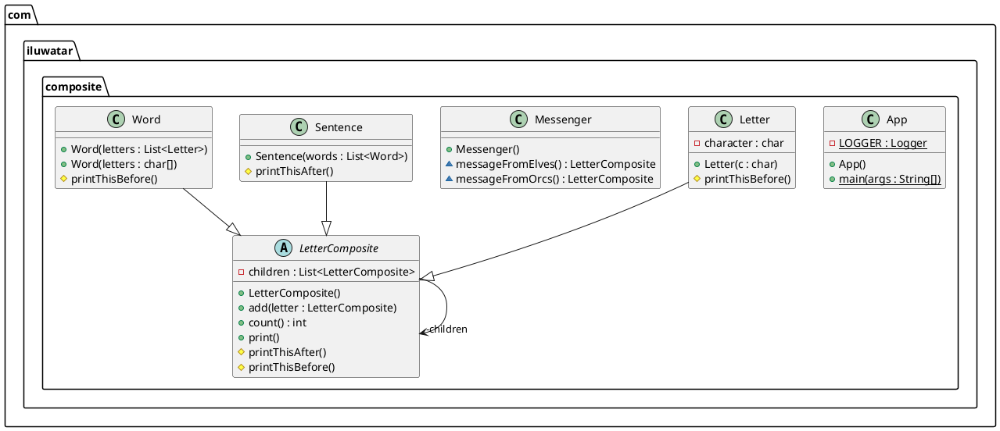

```java
// Step 1 ~ Step 2
// 因为例子比较简单，没有定义接口，直接定义抽象类提取公共接口
public abstract class LetterComposite {

  private final List<LetterComposite> children = new ArrayList<>();

  public void add(LetterComposite letter) {
    children.add(letter);
  }

  public int count() {
    return children.size();
  }

  protected void printThisBefore() {
  }

  protected void printThisAfter() {
  }

  /**
   * Print.
   */
  public void print() {
    printThisBefore();
    children.forEach(LetterComposite::print);
    printThisAfter();
  }
}


// Step 3，定义具体类
@RequiredArgsConstructor
public class Letter extends LetterComposite {

  private final char character;

  @Override
  protected void printThisBefore() {
    System.out.print(character);
  }
}


public class Word extends LetterComposite {

  /**
   * Constructor.
   */
  public Word(List<Letter> letters) {
    letters.forEach(this::add);
  }

  /**
   * Constructor.
   * @param letters to include
   */
  public Word(char... letters) {
    for (char letter : letters) {
      this.add(new Letter(letter));
    }
  }

  @Override
  protected void printThisBefore() {
    System.out.print(" ");
  }
}


public class Sentence extends LetterComposite {

  /**
   * Constructor.
   */
  public Sentence(List<Word> words) {
    words.forEach(this::add);
  }

  @Override
  protected void printThisAfter() {
    System.out.print(".\n");
  }
}

// Step 4的模拟
public class Messenger {

  LetterComposite messageFromOrcs() {

    var words = List.of(
        new Word('W', 'h', 'e', 'r', 'e'),
        new Word('t', 'h', 'e', 'r', 'e'),
        new Word('i', 's'),
        new Word('a'),
        new Word('w', 'h', 'i', 'p'),
        new Word('t', 'h', 'e', 'r', 'e'),
        new Word('i', 's'),
        new Word('a'),
        new Word('w', 'a', 'y')
    );

    return new Sentence(words);

  }

  LetterComposite messageFromElves() {

    var words = List.of(
        new Word('M', 'u', 'c', 'h'),
        new Word('w', 'i', 'n', 'd'),
        new Word('p', 'o', 'u', 'r', 's'),
        new Word('f', 'r', 'o', 'm'),
        new Word('y', 'o', 'u', 'r'),
        new Word('m', 'o', 'u', 't', 'h')
    );

    return new Sentence(words);

  }

}
```

## Flyweight(享元模式)

通过底层共享技术来支持节约内存，使用有限的内存存储大量对象，并且这些对象之间存在很多共享部分（白话的意思就是很多内容相同）。

所谓“享元”，顾名思义就是被共享的单元。享元模式的意图是复用对象，节省内存，前提是享元对象是不可变对象。具体来讲，当一个系统中存在大量重复对象的时候，我们就可以利用享元模式，将对象设计成享元，在内存中只保留一份实例，供多处代码引用，这样可以减少内存中对象的数量，以起到节省内存的目的。实际上，不仅仅相同对象可以设计成享元，对于相似对象，我们也可以将这些对象中相同的部分（字段），提取出来设计成享元，让这些大量相似对象引用这些享元。

**由于`Flyweight`模式是通过共享技术实现，所以用户必须确保对象不能够被修改。通常的做法是`Flyweight`对象只有在构建的时候初始化一次，后面只能够被用户读取，不能够被修改。所以一般情况下`Flyweight`对象不会开放`setter`接口给外部**

# 行为型设计模式

## Observer(观察者模式)

> **Observer** is a behavioral design pattern that lets you define a subscription mechanism to notify multiple objects about any events that happen to the object they’re observing.

`观察者模式`定义了一个订阅机制，当特定事件发生时可以通知所有被`观察`的对象。这种模式最常见于我们的`GUI`编程中，一个窗口需要时刻关注各类`事件`，例如 鼠标和键盘事件。

观察者模式将观察者和被观察者代码解耦。观察者模式的应用场景非常广泛，小到代码层面的[解耦](https://www.zhihu.com/search?q=%E8%A7%A3%E8%80%A6&search_source=Entity&hybrid_search_source=Entity&hybrid_search_extra=%7B%22sourceType%22%3A%22article%22%2C%22sourceId%22%3A%22345126462%22%7D)，大到架构层面的系统解耦，再或者一些产品的设计思路，都有这种模式的影子，比如，邮件订阅、RSS Feeds，本质上都是观察者模式。

不同的应用场景和需求下，这个模式也有截然不同的实现方式：有同步阻塞的实现方式，也有异步非阻塞的实现方式；有进程内的实现方式，也有跨进程的实现方式。同步阻塞是最经典的实现方式，主要是为了代码解耦；异步非阻塞除了能实现代码解耦之外，还能提高代码的执行效率；进程间的观察者模式解耦更加彻底，一般是基于消息队列来实现，用来实现不同进程间的被观察者和观察者之间的交互。

框架的作用有隐藏实现细节，降低开发难度，实现代码复用，解耦业务与非业务代码，让程序员聚焦业务开发。针对异步非阻塞观察者模式，我们也可以将它抽象成EventBus框架来达到这样的效果。EventBus翻译为“事件总线”，它提供了实现观察者模式的骨架代码。我们可以基于此框架非常容易地在自己的业务场景中实现观察者模式，不需要从零开始开发。

## Strategy(策略模式)

策略模式定义一族算法类，将每个算法分别封装起来，让它们可以互相替换。策略模式可以使算法的变化独立于使用它们的客户端（这里的客户端代指使用算法的代码）。策略模式用来解耦策略的定义、创建、使用。实际上，一个完整的策略模式就是由这三个部分组成的。

策略类的定义比较简单，包含一个策略接口和一组实现这个接口的策略类。策略的创建由工厂类来完成，封装策略创建的细节。策略模式包含一组策略可选，客户端代码选择使用哪个策略，有两种确定方法：编译时静态确定和运行时动态确定。其中，“运行时动态确定”才是策略模式最典型的应用场景。

在实际的项目开发中，策略模式也比较常用。最常见的应用场景是，利用它来避免冗长的if-else或switch分支判断。不过，它的作用还不止如此。它也可以像模板模式那样，提供框架的扩展点等等。实际上，策略模式主要的作用还是解耦策略的定义、创建和使用，控制代码的复杂度，让每个部分都不至于过于复杂、代码量过多。除此之外，对于复杂代码来说，策略模式还能让其满足开闭原则，添加新策略的时候，最小化、集中化代码改动，减少引入bug的风险。

## Chain of responsibility(责任链模式)

在职责链模式中，多个处理器依次处理同一个请求。一个请求先经过A处理器处理，然后再把请求传递给B处理器，B处理器处理完后再传递给C处理器，以此类推，形成一个链条。链条上的每个处理器各自承担各自的处理职责，所以叫作职责链模式。

在GoF的定义中，一旦某个处理器能处理这个请求，就不会继续将请求传递给后续的处理器了。当然，在实际的开发中，也存在对这个模式的变体，那就是请求不会中途终止传递，而是会被所有的[处理器](https://www.zhihu.com/search?q=%E5%A4%84%E7%90%86%E5%99%A8&search_source=Entity&hybrid_search_source=Entity&hybrid_search_extra=%7B%22sourceType%22%3A%22article%22%2C%22sourceId%22%3A%22345126462%22%7D)都处理一遍。

职责链模式常用在框架开发中，用来实现过滤器、拦截器功能，让框架的使用者在不需要修改框架源码的情况下，添加新的过滤、拦截功能。这也体现了之前讲到的对扩展开放、对修改关闭的设计原则。

## Iterator(迭代器模式)

迭代器模式也叫游标模式，它用来遍历集合对象。这里说的“集合对象”，我们也可以叫“容器”“聚合对象”，实际上就是包含一组对象的对象，比如，数组、链表、树、图、跳表。迭代器模式主要作用是解耦容器代码和遍历代码。大部分编程语言都提供了现成的迭代器可以使用，我们不需要从零开始开发。

遍历集合一般有三种方式：for循环、foreach循环、迭代器遍历。后两种本质上属于一种，都可以看作迭代器遍历。相对于for循环遍历，利用迭代器来遍历有3个优势：

- 迭代器模式封装集合内部的复杂数据结构，开发者不需要了解如何遍历，直接使用容器提供的迭代器即可；

- 迭代器模式将集合对象的遍历操作从集合类中拆分出来，放到迭代器类中，让两者的职责更加单一；

- 迭代器模式让添加新的遍历算法更加容易，更符合开闭原则。除此之外，因为迭代器都实现自相同的接口，在开发中，基于接口而非实现编程，替换迭代器也变得更加容易。

在通过迭代器来遍历集合元素的同时，增加或者删除集合中的元素，有可能会导致某个元素被重复遍历或遍历不到。针对这个问题，有两种比较干脆利索的解决方案，来避免出现这种不可预期的运行结果。一种是遍历的时候不允许增删元素，另一种是增删元素之后让遍历报错。第一种解决方案比较难实现，因为很难确定迭代器使用结束的时间点。第二种解决方案更加合理，Java语言就是采用的这种解决方案。增删元素之后，我们选择fail-fast解决方式，让遍历操作直接抛出运行时异常。

## State(状态模式)

状态模式一般用来实现状态机，而[状态机](https://www.zhihu.com/search?q=%E7%8A%B6%E6%80%81%E6%9C%BA&search_source=Entity&hybrid_search_source=Entity&hybrid_search_extra=%7B%22sourceType%22%3A%22article%22%2C%22sourceId%22%3A%22345126462%22%7D)常用在游戏、工作流引擎等系统开发中。状态机又叫[有限状态机](https://www.zhihu.com/search?q=%E6%9C%89%E9%99%90%E7%8A%B6%E6%80%81%E6%9C%BA&search_source=Entity&hybrid_search_source=Entity&hybrid_search_extra=%7B%22sourceType%22%3A%22article%22%2C%22sourceId%22%3A%22345126462%22%7D)，它由3个部分组成：状态、事件、动作。其中，事件也称为转移条件。事件触发状态的转移及动作的执行。不过，动作不是必须的，也可能只转移状态，不执行任何动作。

针对状态机，我们总结了三种实现方式。

第一种实现方式叫分支逻辑法。利用if-else或者switch-case分支逻辑，参照状态转移图，将每一个状态转移原模原样地直译成代码。对于简单的状态机来说，这种实现方式最简单、最直接，是首选。

第二种实现方式叫查表法。对于状态很多、状态转移比较复杂的状态机来说，查表法比较合适。通过[二维数组](https://www.zhihu.com/search?q=%E4%BA%8C%E7%BB%B4%E6%95%B0%E7%BB%84&search_source=Entity&hybrid_search_source=Entity&hybrid_search_extra=%7B%22sourceType%22%3A%22article%22%2C%22sourceId%22%3A%22345126462%22%7D)来表示状态转移图，能极大地提高代码的可读性和可维护性。

第三种实现方式就是利用状态模式。对于状态并不多、状态转移也比较简单，但事件触发执行的动作包含的业务逻辑可能比较复杂的状态机来说，我们首选这种实现方式。

## Memoto(备忘录模式)

备忘录模式也叫快照模式，具体来说，就是在不违背封装原则的前提下，捕获一个对象的内部状态，并在该对象之外保存这个状态，以便之后恢复对象为先前的状态。这个模式的定义表达了两部分内容：一部分是，存储副本以便后期恢复；另一部分是，要在不违背封装原则的前提下，进行对象的备份和恢复。

备忘录模式的应用场景也比较明确和有限，主要用来防丢失、撤销、恢复等。它跟平时我们常说的“备份”很相似。两者的主要区别在于，备忘录模式更侧重于代码的设计和实现，备份更侧重架构设计或产品设计。

对于大对象的备份来说，备份占用的存储空间会比较大，备份和恢复的耗时会比较长。针对这个问题，不同的业务场景有不同的处理方式。比如，只备份必要的恢复信息，结合最新的数据来恢复；再比如，全量备份和增量备份相结合，低频全量备份，高频增量备份，两者结合来做恢复。

## Command(命令模式)

命令模式在平时工作中并不常用，你稍微了解一下就可以。

落实到编码实现，命令模式用到最核心的实现手段，就是将函数封装成对象。我们知道，在大部分编程语言中，函数是没法作为参数传递给其他函数的，也没法赋值给变量。借助命令模式，我们将函数封装成对象，这样就可以实现把函数像对象一样使用。

命令模式的主要作用和应用场景，是用来控制命令的执行，比如，异步、延迟、排队执行命令、撤销重做命令、存储命令、给命令记录日志等，这才是命令模式能发挥独一无二作用的地方。

## Template Method(模板模式)

模板方法模式在一个方法中定义一个算法骨架，并将某些步骤推迟到子类中实现。模板方法模式可以让子类在不改变算法整体结构的情况下，重新定义算法中的某些步骤。这里的“算法”，我们可以理解为广义上的“业务逻辑”，并不特指数据结构和算法中的“算法”。这里的算法骨架就是“模板”，包含算法骨架的方法就是“模板方法”，这也是模板方法模式名字的由来。

模板模式有两大作用：复用和扩展。其中复用指的是，所有的子类可以复用父类中提供的模板方法的代码。扩展指的是，框架通过模板模式提供功能扩展点，让框架用户可以在不修改框架源码的情况下，基于扩展点定制化框架的功能。

除此之外，我们还讲到回调。它跟模板模式具有相同的作用：代码复用和扩展。在一些框架、类库、组件等的设计中经常会用到，比如JdbcTemplate就是用了回调。

相对于普通的函数调用，回调是一种双向调用关系。A类事先注册某个函数F到B类，A类在调用B类的P函数的时候，B类反过来调用A类注册给它的F函数。这里的F函数就是“回调函数”。A调用B，B反过来又调用A，这种调用机制就叫作“回调”。

回调可以细分为同步回调和异步回调。从应用场景上来看，同步回调看起来更像模板模式，异步回调看起来更像观察者模式。回调跟模板模式的区别，更多的是在代码实现上，而非应用场景上。回调基于组合关系来实现，模板模式基于继承关系来实现。回调比模板模式更加灵活。

## Mediator(中介模式)

中介模式的设计思想跟[中间层](https://www.zhihu.com/search?q=%E4%B8%AD%E9%97%B4%E5%B1%82&search_source=Entity&hybrid_search_source=Entity&hybrid_search_extra=%7B%22sourceType%22%3A%22article%22%2C%22sourceId%22%3A%22345126462%22%7D)很像，通过引入中介这个中间层，将一组对象之间的交互关系（或者说依赖关系）从多对多（网状关系）转换为一对多（星状关系）。原来一个对象要跟n个对象交互，现在只需要跟一个中介对象交互，从而最小化对象之间的交互关系，降低了代码的复杂度，提高了代码的可读性和可维护性。

观察者模式和中介模式都是为了实现参与者之间的解耦，简化交互关系。两者的不同在于应用场景上。在观察者模式的应用场景中，参与者之间的交互比较有条理，一般都是单向的，一个参与者只有一个身份，要么是观察者，要么是被观察者。而在中介模式的应用场景中，参与者之间的交互关系错综复杂，既可以是消息的发送者、也可以同时是消息的接收者。

## Visitor(访问者模式)

访问者模式允许一个或者多个操作应用到一组对象上，设计意图是解耦操作和对象本身，保持类职责单一、满足开闭原则以及应对代码的复杂性。

对于访问者模式，学习的主要难点在代码实现。而代码实现比较复杂的主要原因是，函数重载在大部分面向对象编程语言中是静态绑定的。也就是说，调用类的哪个重载函数，是在编译期间，由参数的声明类型决定的，而非运行时，根据参数的实际类型决定的。除此之外，我们还讲到Double Disptach。如果某种语言支持Double Dispatch，那就不需要访问者模式了。

正是因为代码实现难理解，所以，在项目中应用这种模式，会导致代码的可读性比较差。如果你的同事不了解这种设计模式，可能就会读不懂、维护不了你写的代码。所以，除非不得已，不要使用这种模式。
